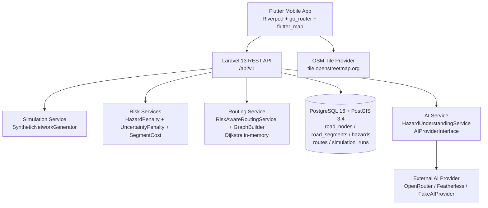

# QuakeRoute

**QuakeRoute: AI-Powered Post-Earthquake Risk-Aware Navigation**

QuakeRoute is a mobile safety navigation prototype designed for the critical period immediately after an earthquake, when road conditions can change rapidly and conventional navigation becomes unreliable. Roads that were safe minutes earlier may suddenly become blocked by debris, fire, flooding, fallen power lines, damaged buildings, or other hazards. At the same time, information about these conditions is often incomplete, unstructured, and constantly changing, making it difficult for conventional shortest path navigation systems to respond effectively.

QuakeRoute addresses this problem by incorporating real time post earthquake risk information into navigation decisions. Users can report hazards through photos, text, and quick reports, allowing the system to build a continuously updated picture of potential risks on the road network. AI is used to interpret and assess these reports, while a risk aware routing system considers the identified hazards when determining a safer alternative route.

Instead of simply finding the shortest path, QuakeRoute aims to answer a more important question in an emergency: **which route is safer given what we currently know about the surrounding risks?**

The prototype demonstrates how community generated hazard information, AI assisted risk understanding, and risk aware routing can work together to support safer navigation when normal road conditions and navigation assumptions can no longer be trusted.

> **Scope:** This is a 10-day hackathon prototype, not a production emergency system. No route is guaranteed safe. The system is a decision-support tool validated in a controlled simulation environment.

---

## Table of Contents

- [Demo](#demo)
- [The Problem](#the-problem)
- [Our Solution](#our-solution)
- [Key Features](#key-features)
- [How the Emergency Simulation Works](#how-the-emergency-simulation-works)
- [Technical Architecture](#technical-architecture)
- [Routing & Risk-Aware Decision Making](#routing--risk-aware-decision-making)
- [AI Component](#ai-component)
- [Data & Simulation](#data--simulation)
- [Tech Stack](#tech-stack)
- [Project Structure](#project-structure)
- [Getting Started](#getting-started)
- [Current Limitations](#current-limitations)
- [Future Improvements](#future-improvements)
- [Hackathon Impact](#hackathon-impact)

---

## Demo

Watch the **QuakeRoute Demo** on YouTube:

https://youtu.be/yyYmhJ6Es-4

The demo showcases the main application flow, hazard reporting, destination selection, Emergency Simulation, risk aware routing, and alternative route recommendations.

Screenshots and architecture diagrams are available in `docs/`.

---

## The Problem

After an earthquake, the navigation decision problem changes fundamentally:

- **Road conditions change rapidly** — debris, collapsed buildings, fire, flooding, and electrical hazards can appear with little warning.
- **Hazard information arrives late and from the community** — bystanders and evacuees, often under stress, are the primary reporters. Their input is incomplete, varying in quality, and may conflict.
- **Conventional navigation optimizes for the wrong thing** — it answers "what is the fastest way?" even when the fastest way traverses a freshly blocked or high-risk segment.
- **Uncertainty is the norm, not the exception** — not every hazard is known, not every report is confirmed, and two people may describe the same segment differently.

The core question QuakeRoute addresses is: **how can a navigation system help users choose a safer reasonable route when road conditions are dynamic, information is uncertain, and reporting must be low-effort?**

---

## Our Solution

QuakeRoute is a **risk-aware navigation system** that compares a conventional baseline route against a risk-adjusted alternative and recommends the lower-risk feasible option when the original path is affected.

```text
User Location
      ↓
Map & Destination
      ↓
Hazard / Road Information (community reports + AI interpretation)
      ↓
Risk Assessment (severity + confidence → cost)
      ↓
Route Evaluation (Dijkstra over risk-adjusted cost graph)
      ↓
Risk-Aware Alternative Route (if warranted)
```

Key properties:

- The **baseline route** is a conventional shortest path using only `Base Travel Cost`.
- The **risk-aware route** uses `Segment Routing Cost = Base Travel Cost + Hazard Penalty + Uncertainty Penalty`, excluding `Blocked` segments entirely.
- When a new hazard affects an active route, the system detects the intersection and recalculates.
- All routing behavior can be demonstrated reproducibly without a real disaster via the Emergency Simulation.

---

## Key Features

### Dynamic Safety Map

- Interactive map built with `flutter_map` + OpenStreetMap tiles.
- Shows user location (via `geolocator`), road network geometry from PostGIS, shelters and medical facilities, and hazard pins.
- Segments are colored by worst active hazard status; pins encode type, severity, and confidence/status (color + icon + label, never color alone).
- Hazard detail bottom sheet exposes confidence, timestamp, source, evidence, and affected segment(s).

### Hazard Reporting

Three implemented modes feeding the same structured pipeline:

| Mode | Effort | AI Involved | Flow |
|------|--------|-------------|------|
| **Photo** | Low typing | Yes — AI Vision proposes type/severity/road impact/confidence → user must Confirm / Edit / Reject | `image_picker` → suggestion → review panel |
| **Text** | Medium | Yes — AI text extraction may yield 1..N hazards from one report | Free text → extraction → per-hazard review |
| **Quick Report** | Lowest | No — predefined category selection gets a default confidence | Category grid (6 types) → location confirm |

> **Voice Reporting** — Planned / not yet implemented (`501 Not Implemented` on the backend; disabled tile in the mobile report selector). Architecture and DB support `Voice` / `AIVoiceExtraction` but the feature is not available in the current prototype.

Supported hazard types (MVP, in both frontend `enums.dart:1` and backend allow-list): `DebrisRubble`, `RoadBlockage`, `Fire`, `Flood`, `ElectricalHazard`, `VisibleBuildingDamage`.

### Risk-Aware Routing

- Baseline and risk-aware routes are computed on the same road graph for a fair comparison.
- High-severity, high-confidence hazards produce a large `Hazard Penalty` without necessarily blocking the segment.
- Fully `Blocked` segments are excluded (treated as infinite cost).
- Seen in the route panel (`RoutingScreen`) and the simulation comparison view.

### Emergency Simulation

The primary demonstration mechanism:

- Crosshair-based simulation location selection (100% GPS-free for the simulation origin).
- Synthetic 4x4 grid road network, 5 synthetic destinations, deterministic generation from `seed + center`.
- Deterministic hazard scenarios seeded to target the baseline path so divergence is visible.
- Baseline vs. risk-aware comparison with cost and segment breakdown.
- Isolated synthetic data per run (`is_synthetic` + `simulation_run_id`) — does not pollute the normal/home map.

---

## How the Emergency Simulation Works

The simulation is the project's demonstration and validation harness. It is a thin orchestrator over the production Hazard → AI → Risk → Routing flow, not a separate mock.

```text
Move Map
   ↓
Crosshair Defines Simulation Center (no GPS required)
   ↓
Use This Location  →  generate synthetic environment deterministically
   ↓
Select Destination (distance shown from simulation origin)
   ↓
Generate Synthetic Network (4×4 grid + diagonals + jitter, seed + center → UUIDs)
   ↓
Generate Baseline Route (risk penalties excluded)
   ↓
Apply Scenario Hazard(s) on Baseline Path Segments
   ↓
Calculate Risk-Aware Route (full costs applied)
   ↓
Compare Routes (overlap vs. divergence + costs)
```

Details:

- **Frontend generator:** `quakeroute-mobile/lib/features/simulation/support/synthetic_network_generator.dart:14` mirrors `quakeroute-api/app/Modules/Simulation/Support/SyntheticNetworkGenerator.php:17`. Span = `radiusM * 1.2`, spacing computed from span, jitter ±25m, 2–4 extra diagonals seeded via `Mt19937(seed)` / `Random(seed)`.
- **Center locking:** Deterministic UUID uses `md5(seed-prefix-idx-round(lat,5)-round(lng,5))` on both sides (`synthetic_network_generator.dart:108`, `SyntheticNetworkGenerator.php:136`), so the same center + seed yields the same network.
- **Seed & radius:** Default `radiusM = 1500`, random seed per confirmation stored in `SimulationState`; displayed as `Seed: … • Radius: … m`.
- **Preview route:** Before Run, a local Dijkstra preview follows the synthetic network (not a straight line).
- **Backend synthetic mode:** Triggered when `center: {lat,lng}` is present in `POST /simulation/scenarios/{id}/run` (`SimulationService.php:43`). Nodes/segments/destinations are `updateOrInsert`-ed with `is_synthetic = true` and `simulation_run_id = runId`.
- **Stale detection:** Moving the map after confirmation shows an amber "Location changed — confirm to update destinations" banner; destinations only refresh after re-confirmation.
- **Isolation:** All hazards, routes, and synthetic graph rows are linked via `simulation_run_hazards` / `simulation_run_id` and excluded from baseline cost graph for the comparison to stay fair.

#### Implemented Scenarios

Verified against `quakeroute-api/database/seeders/SimulationScenarioSeeder.php:19`:

| Scenario ID | Name | What It Demonstrates |
|-------------|------|---------------------|
| `no_hazard` | No Hazard | Risk-aware keeps the normal route — no hazards, no divergence |
| `blocked_road` | Blocked Road | Segment on shortest path is `Blocked` → Dijkstra avoids it |
| `high_risk_hazard` | High-Risk Hazard | High severity + high confidence (`Fire`, `PartiallyBlocked`) heavily penalizes the shortest segment; longer alternative preferred |
| `new_hazard_during_navigation` | New Hazard During Navigation | Same as blocked — replaces active route (synthetic targeted placement) |
| `conflicting_reports` | Conflicting Reports | Two reports on same segment: `Flood High/Blocked/Confirmed` + `Flood Low/Passable/UncertainConflicting` — status `UncertainConflicting` + uncertainty penalty |
| `ai_vision_hazard_report` | AI Vision Hazard Report | Photo-origin hazard (`VisibleBuildingDamage`, `Medium/PartiallyBlocked/Reported`) on path |

Scenario data uses fixed segment `B→C` (`aaaaaaaa-aaaa-aaaa-aaaa-aaaaaaaaaaa2`) for the seeded legacy network; synthetic mode targets a random segment of the computed baseline path via a `Mt19937(seed + crc32(scenarioId))` picker (`SimulationService.php:289`).

---

## Technical Architecture



Inspired by `docs/architecture-document.md:24` — adapted to the actual implementation.

**Modular monolith** (`quakeroute-api/app/Modules/`): `AI`, `Risk`, `Routing`, `Road`, `Route`, `Destination`, `Hazard`, `Simulation`, `Shared`. One deployable Laravel app, logically separated via contracts/interfaces (e.g., `AIProviderInterface` at `app/Modules/AI/Contracts/AIProviderInterface.php:8`, `RoutingEngineInterface` at `app/Modules/Routing/Contracts/RoutingEngineInterface.php:6`).

| Layer | Responsibility | Does NOT Do |
|-------|---------------|-------------|
| **Mobile** (`quakeroute-mobile/lib/`) | Map rendering, reporting flows, route display, simulation trigger, crosshair selection | Risk scoring, routing computation, DB access |
| **Hazard Module** | Accepts Observations, persists `hazard_reports`/`hazard_suggestions`/`hazards`, lifecycle status | Severity/confidence estimation for photo/text (delegates to AI) |
| **AI Module** (`AI Service Abstraction`) | Converts Observation → candidate hazard(s) with type/severity/confidence/road impact | Stores final hazard, determines status lifecycle, chooses routes |
| **Risk Module** (`app/Modules/Risk/Services/`) | `HazardPenalty` + `UncertaintyPenalty` → `Segment Routing Cost` per segment | Stores hazards, runs pathfinding |
| **Routing Module** | Builds cost graph via `GraphBuilder` from segment costs, runs Dijkstra, detects affected active routes | Computes hazard/uncertainty penalties |
| **Simulation Module** | Defines 6 scenarios as data, orchestrates replay through production services, persists baseline + risk-aware routes | Own risk/AI/routing logic |

---

## Routing & Risk-Aware Decision Making

Based on `docs/domain-risk-model.md:373` and the implemented `quakeroute-api/app/Modules/Risk/Services/RiskCalculationService.php:27`:

### Baseline Route

Conventional shortest path over `Base Travel Cost` only. Hazard and uncertainty penalties are zeroed (for simulation, built via `GraphBuilder::buildFromDatabase(excludeHazardIds)` / in-memory `segmentsWithHazardsForGraph`).

### Risk-Aware Route

Path minimizing total risk-adjusted cost:

```text
Road Network (road_nodes + road_segments from PostGIS or synthetic in-memory)
     ↓
Baseline Route  (Base Travel Cost only, for comparison)
     ↓
Hazard Information  (severity, confidence, road impact, status)
     ↓
Risk Evaluation  —  per segment:
     HazardPenalty = max( SeverityWeight(h) × ConfidenceFactor(h) )   // Max aggregation over hazards on segment
     UncertaintyPenalty = weight(Status)                               // Reported=5, Confirmed=0, Conflicting=20 (config/risk.php:27)
     ↓
Modified Routing Cost
     if SegmentRoadImpact == Blocked → SegmentRoutingCost = INF (excluded)
     else SegmentRoutingCost = BaseTravelCost + HazardPenalty + UncertaintyPenalty
     ↓
Risk-Aware Route  (Dijkstra over updated graph — RiskAwareRoutingService.php:28)
```

Concrete defaults (`quakeroute-api/config/risk.php:17` + `.env.example:42`):

| Parameter | Default |
|-----------|---------|
| `RISK_SEVERITY_LOW` | `10` |
| `RISK_SEVERITY_MEDIUM` | `30` |
| `RISK_SEVERITY_HIGH` | `100` |
| `RISK_CONFIDENCE_MODE` | `linear` (factor = confidence 0..1) |
| `RISK_UNCERTAINTY_REPORTED` | `5` |
| `RISK_UNCERTAINTY_CONFLICTING` | `20` |
| `RISK_UNCERTAINTY_CONFIRMED` | `0` |
| `RISK_BLOCKED_COST` | `PHP_INT_MAX` |

Multi-hazard aggregation uses **Max** (worst hazard dominates) for both road impact and hazard penalty (`docs/domain-risk-model.md:410`), consistent with the database note that segment-level impact is "worst-of". The baseline and risk-aware routes share the same base graph — only the penalty inclusion differs — so the comparison is fair (`docs/architecture-document.md:340`).

---

## AI Component

AI is strictly a **multimodal hazard understanding layer** — `docs/ai-requirement.md:32`:

```text
AI → Understand / interpret hazard information  (type, severity, confidence, road impact)
Routing Engine → Calculate route                (Dijkstra over cost graph)
Risk Model → Evaluate route safety             (penalties → segment costs)
```

| Question | Answer (implemented) |
|----------|---------------------|
| **What enters the AI?** | Raw `hazard_report`: `mode` (`Photo`/`Text`), `raw_text`/`note`, `photo_url`/`audio_url`, `location` |
| **What does the AI analyze?** | Photo via Vision or text via LLM extraction — identifies hazard type(s) from the 6-value set, estimates severity and road impact, assigns confidence |
| **What does it produce?** | `StructuredHazardDTO` (`app/Modules/AI/DTOs/StructuredHazardDTO.php:9`): `type`, `severity` (`Low`/`Medium`/`High`), `confidence` (0..1), `roadImpact` (`Passable`/`PartiallyBlocked`/`Blocked`), plus optional evidence/context. Validated by `HazardSuggestionValidator` |
| **How does output influence the system?** | DTO → `hazard_suggestions` row `PendingConfirmation` (photo) → on user confirm → `hazards` row `Reported` → Risk Module computes new segment cost → Routing re-evaluates if affected |
| **What is deterministic instead?** | Severity/uncertainty weights, segment cost math, Dijkstra pathfinding, conflict detection, blocked exclusion — all handled outside the AI provider |

**Provider abstraction:** All AI calls go through `AIProviderInterface::extractHazard()` (`app/Modules/AI/Contracts/AIProviderInterface.php:8`). No other module touches a vendor SDK.

- **FakeAIProvider** (`app/Modules/AI/Providers/FakeAIProvider.php:11`): deterministic offline heuristic — e.g., text containing "blocked" → `RoadBlockage High/Blocked 0.92`; "shallow water"/"still pass" → `Flood Low/Passable 0.78`; fallback `DebrisRubble Medium/PartiallyBlocked 0.75`. Used for tests and when no API key is configured.
- **HttpAIProvider** (`app/Modules/AI/Providers/HttpAIProvider.php:12`): calls OpenRouter or Featherless with prompt `HazardExtractionPrompt` (`app/Modules/AI/Prompts/HazardExtractionPrompt.php:6`), JSON-mode, retries. Active provider selected via `AI_PROVIDER` in `.env` (`openrouter`/`featherless`/`fake`).

**Safety boundaries** (enforced in `AI-Requirements.md`):

- AI never determines routes, never marks its own prediction as verified fact, never guarantees safety.
- Every AI-produced suggestion enters as `PendingConfirmation` (`hazard_suggestions.status`) and is not routable until confirmed.
- `HazardUnderstandingService::processReport()` (`app/Modules/AI/Services/HazardUnderstandingService.php:29`) logs and surfaces provider failures without corrupting downstream data.
- Evidence/source is retained on every hazard (`hazard_report_id`, `source`).

---

## Data & Simulation

| Concept | Meaning | Why It Exists |
|---------|---------|---------------|
| **Real application data** | `road_nodes`/`road_segments` seeded from `RoadNetworkSeeder`, `destinations` from `DestinationSeeder`, user-created `hazards`/`routes` | Provides the persistent controlled network and live user contributions |
| **Synthetic simulation data** | Nodes/segments/destinations generated per run by `SyntheticNetworkGenerator`, hazards created per scenario on the baseline path | Lets judges reproduce routing behavior without a real disaster or live emergency dataset |
| **Simulation center** | `lat/lng` under the fixed crosshair at confirmation time (`SimulationState.simulationCenter` in `simulation_controller.dart:24`) | 100% GPS-free origin; map drag updates center but does not auto-refresh synthetic network |
| **Simulation radius** | `1500` m default (env-configurable, passed as `radiusM` to `generate()`) | Controls grid span (`radius * 1.2`) and destination offsets |
| **Deterministic seed** | `random_int` persisted per run; same seed + rounded center (`5` decimals) → identical UUIDs/graph (`SyntheticNetworkGenerator.php:136`) | Reproducibility (`docs/simulation-validation.md:9`) |
| **Isolation** | `is_synthetic = true`, `simulation_run_id = runId` on all synthetic rows; `simulation_run_hazards` join table; baseline graph excludes injected hazard IDs | No pollution of the home/normal map data; synthetic hazards never appear in `GET /hazards` unless queried via `GET /simulation/runs/{id}` |

> The same simulation center and seed produce a reproducible synthetic environment. Change either and you get a distinct, equally-valid test world.

---

## Tech Stack

Verified against `pubspec.yaml:10`, `composer.json:8`, `compose.yaml:1`, and `docs/tech-stack.md:14`.

| Layer | Technology | Notes |
|-------|------------|-------|
| **Mobile** | Flutter 3.9.2 | Feature-oriented architecture (`lib/features/` + `lib/core/`) |
| **Maps** | `flutter_map` 8.2.1 + `latlong2` 0.9.1 / OpenStreetMap tiles | Tile URL via `TILE_URL_TEMPLATE` env |
| **State Management** | `flutter_riverpod` 2.6.1 | Per-feature controllers/providers, `ProviderScope` at `main.dart` |
| **Location** | `geolocator` 13.0.4 | Real GPS only for home map / report origin; simulation is GPS-free |
| **Networking** | `dio` 5.7.0 | Single `ApiClient` + `ApiEndpoints` (`lib/core/network/`) |
| **Media** | `image_picker` 1.1.2 | Photo report capture |
| **Routing (UI)** | `go_router` 14.8.1 | Hub-and-spoke rooted at `/` (`lib/app_router.dart:18`) |
| **Theming** | `google_fonts` 6.2.1 | QRDS custom `QRTokens` |
| **Utilities** | `flutter_dotenv` 5.2.1, `crypto` 3.0.6 | Env + deterministic UUID (must mirror PHP) |
| **Backend** | Laravel 13.17 / PHP 8.3 | Modular monolith (`app/Modules/`) |
| **API** | REST `/api/v1` | 13 endpoints (`routes/api.php:12`) |
| **Database** | PostgreSQL 16 + PostGIS 3.4 | `geography(Point/LineString,4326)` + GIST indexes |
| **AI** | Provider-agnostic: OpenRouter / Featherless / Fake | `AIProviderInterface` + `HazardUnderstandingService` |
| **Routing Engine** | In-app Dijkstra (`RiskAwareRoutingService` + `GraphBuilder`) | `TBD` in docs, concretely Dijkstra over in-memory graph |
| **Containerization** | Docker Compose (`quakeroute-api/compose.yaml:1`) | `quakeroute-app` + `quakeroute-db` + `pgdata` volume |
| **Container Base** | `postgis/postgis:16-3.4` | DB healthcheck with `pg_isready` |
| **Tests** | `phpunit` 12.5 / `flutter_test` | `tests/Feature/Api/BackendApiTest.php` covers API behavior |

---

## Project Structure

```text
quakeroute-mobile/                  # repository root (this README lives here)
├── docs/                           # product & technical documentation
│   ├── prd.md
│   ├── srs.md
│   ├── domain-risk-model.md
│   ├── ai-requirement.md
│   ├── architecture-document.md
│   ├── api-specification.md
│   ├── database-schema.md
│   ├── simulation-validation.md
│   ├── ui-ux-specification.md
│   ├── tech-stack.md
│   └── test-cases.md
│
├── quakeroute-api/                 # Laravel 13 backend (modular monolith)
│   ├── app/
│   │   ├── Http/
│   │   │   ├── Controllers/Api/V1/
│   │   │   └── Requests/Api/V1/
│   │   ├── Modules/
│   │   │   ├── AI/            (Contracts, Providers, Services, DTOs)
│   │   │   ├── Risk/          (HazardPenalty, UncertaintyPenalty, SegmentCost)
│   │   │   ├── Routing/       (RiskAwareRoutingService, GraphBuilder)
│   │   │   ├── Simulation/    (SimulationService, SyntheticNetworkGenerator)
│   │   │   ├── Hazard/        (HazardReportService, HazardSuggestionService)
│   │   │   ├── Route/         (RouteService, RouteRecalculationService)
│   │   │   ├── Road/          (RoadSegmentService)
│   │   │   └── Destination/
│   │   └── Providers/
│   ├── config/risk.php
│   ├── database/
│   │   ├── migrations/
│   │   └── seeders/           (RoadNetworkSeeder, DestinationSeeder, SimulationScenarioSeeder)
│   ├── routes/api.php
│   ├── compose.yaml
│   ├── Dockerfile
│   └── .env.example
│
├── quakeroute-mobile/quakeroute-mobile/  # Flutter mobile app
│   ├── lib/
│   │   ├── main.dart
│   │   ├── app.dart / app_router.dart
│   │   ├── core/                  (network, models, theme, state, utils, location)
│   │   └── features/
│   │       ├── map/
│   │       ├── destination/
│   │       ├── reporting/         (photo, text, quick_tap, presentation/report_selector)
│   │       ├── routing/
│   │       ├── simulation/        (controller, presentation, support/synthetic_network_generator, data)
│   │       └── settings/          (disclaimer, disclaimer_gate)
│   ├── pubspec.yaml
│   └── .env.example
│
├── start-dev.ps1 / stop-dev.ps1 / launch-android.ps1
└── README.md                       # this file
```

Only directories that help a developer understand the architecture are shown — file-level detail is in the source tree.

---

## Getting Started

### Requirements

| Tool | Minimum Version | Purpose |
|------|----------------|---------|
| Flutter SDK | 3.9.2 (`sdk: ^3.9.2` in `pubspec.yaml:8`) | Mobile app build/run |
| PHP | 8.3 (`composer.json:9`) | Laravel backend |
| Composer | 2.x | PHP dependency install |
| Docker Desktop + Compose v2 | latest | PostgreSQL+PostGIS + Laravel container |
| Android emulator or device | — | Run the Flutter app (or use `flutter run -d chrome` for web skeleton) |

No manual PostgreSQL install outside Docker is required.

### Backend Setup

From the **repository root** (uses `quakeroute-api/compose.yaml:1`):

**One-command dev bootstrap (recommended):**

```powershell
# From repo root — idempotent, safe to re-run
.\start-dev.ps1
```

This script (`start-dev.ps1:1`) checks prerequisites, copies `.env.example → .env` if needed, runs `docker compose up -d`, waits for `quakeroute-db` healthy, installs `vendor/` if missing, generates `APP_KEY`, runs pending `php artisan migrate --force`, and seeds `SimulationScenarioSeeder` + road network/destinations if under threshold.

**Manual alternative:**

```powershell
cd quakeroute-api
Copy-Item .env.example .env
php artisan key:generate        # or let start-dev do it inside Docker
docker compose up -d
docker compose exec -T app php artisan migrate --force
docker compose exec -T app php artisan db:seed --force

# Verify
Invoke-WebRequest http://localhost:8000/up    # → 200
Invoke-WebRequest http://localhost:8000/api/v1/simulation/scenarios
```

Environment files (see `.env.example:1`):

- `DB_*` point to the `db` service inside Compose; host port `5432` is also exposed.
- `RISK_*` tunables control penalties (see [Routing](#routing--risk-aware-decision-making)).
- `AI_PROVIDER` (`openrouter`/`featherless`/`fake`), `AI_MODEL`, `OPENROUTER_API_KEY` / `FEATHERLESS_API_KEY` select the AI backend. Leaving keys empty falls back to `FakeAIProvider` (offline, deterministic).

### Database Setup

- Migrations live in `quakeroute-api/database/migrations/` and include PostGIS extension creation, `road_nodes`/`road_segments` with `geography` columns, plus `users`, `hazards`, `routes`, `simulation_*` tables.
- Seeders: `RoadNetworkSeeder` creates the fixed controlled network (segment `B→C` = `aaaaaaaa-aaaa-aaaa-aaaa-aaaaaaaaaaa2`), `DestinationSeeder` creates shelters/medical facilities, `SimulationScenarioSeeder` creates the 6 scenarios.

```bash
# Inside Docker — as executed by start-dev.ps1
docker compose -f quakeroute-api/compose.yaml exec -T app php artisan migrate:status
docker compose -f quakeroute-api/compose.yaml exec -T app php artisan migrate --force
docker compose -f quakeroute-api/compose.yaml exec -T app php artisan db:seed --class=SimulationScenarioSeeder --force
docker compose -f quakeroute-api/compose.yaml exec -T app php artisan db:seed --force
```

For a destructive reset:

```bash
php artisan migrate:fresh --seed   # inside the app container
```

### Mobile Setup

```bash
cd quakeroute-mobile/quakeroute-mobile
Copy-Item .env.example .env        # edit API_BASE_URL for your target
flutter pub get
flutter run -d <device>            # or: flutter run -d chrome / -d emulator-5554
```

`.env.example:7` defaults:

```ini
API_BASE_URL=http://10.0.2.2:8000/api/v1   # Android emulator → host
SESSION_ID=local-dev-session-id
TILE_URL_TEMPLATE=https://tile.openstreetmap.org/{z}/{x}/{y}.png
POLL_INTERVAL_SECONDS=20
```

For physical devices or desktop Chrome, change `API_BASE_URL` to `http://localhost:8000/api/v1` or your host LAN IP. `start-dev.ps1:246` prints both endpoints.

To stop the backend:

```powershell
.\stop-dev.ps1   # docker compose down wrapper
```

---

## Current Limitations

Honest prototype scope — none of these imply the core idea is unfinished.

- **Synthetic simulation for demonstration** — no live disaster feed; network is a controlled 4×4 grid + 5 destinations, not a city-scale dataset.
- **Limited real-world hazard data** — hazards in simulation are predefined per scenario, placed on the baseline path for observable divergence.
- **Voice reporting not implemented** — endpoint returns `501`, UI tile is disabled (`lib/features/reporting/presentation/report_selector_screen.dart:36`). Quick-tap defaults for severity/road impact are set server-side.
- **AI confidence/severity not empirically calibrated** — severity weights (`10/30/100`) and uncertainty weights (`5/0/20`) are MVP assumptions (`config/risk.php:17`), not field-validated safety data.
- **Routing is deterministic graph search** — Dijkstra over a small in-memory graph (`RiskAwareRoutingService.php:28`), not a production-grade routing engine or pgRouting.
- **Reproducibility of AI output** — repeated runs with identical input may vary when the external LLM/Vision provider is used; synthetic scenarios avoid this by injecting deterministic hazards.
- **No production deployment readiness** — no push notifications (polling at `POLL_INTERVAL_SECONDS=20`), no offline disaster mode, no auth hardening, no rate limiting or abuse protection, not for real emergency use.
- **No responder/coordinator dashboard** — volunteers use the same evacuee screens (`docs/architecture-document.md:399`).

---

## Future Improvements

Each maps to the existing modular monolith — no rebuild required.

- **Real-time hazard data** — ingest official feeds and trusted validator signals alongside community reports; extend AI providers behind the same `AIProviderInterface`.
- **Stronger road-condition verification** — weighted trust models, corroboration counts, and automated evidence cross-checking before promoting `Reported` → `Confirmed`.
- **Richer geospatial datasets** — import city-scale OSM extracts into PostGIS, replace the synthetic grid for non-simulation routing; keep synthetic mode as the demo harness.
- **Multimodal hazard understanding** — joint image+caption interpretation, Vision coverage beyond the 6 MVP types, speech-to-text wiring for the planned Voice tile.
- **Improved risk modeling** — empirical calibration of severity/uncertainty weights, staleness decay via `reported_at`, per-segment uncertainty proportional to disagreement degree (`docs/domain-risk-model.md:438`).
- **Real-time route updates** — replace polling with WebSocket push; reuse `RouteRecalculationService` trigger logic already in place.
- **Offline disaster-mode navigation** — bundle vector tiles + lightweight routing for degraded connectivity.
- **Larger-scale networks** — swap the in-memory Dijkstra for a scalable engine without changing the Risk/Routing contracts.
- **Emergency-service integration** — responder-facing dashboard, bidirectional share of verified hazard state.

---

## Hackathon Impact

QuakeRoute is not trying to build a faster map. It explores how navigation can **adapt when safety information changes after a disaster**.

```text
Normal Navigation         →  "What is the fastest way?"
QuakeRoute                →  "What is the safest reasonable way given what we currently know?"
```

By separating concerns — AI interprets observations, the risk model prices uncertainty, the router minimizes that price, and the simulation makes the tradeoff visible — the prototype demonstrates a complete decision loop that can incorporate new, imperfect field evidence without pretending it is certainty. The GPS-free, deterministic simulation lets any evaluator reproduce that loop in seconds, on any map location, without touching live infrastructure or user data on the home map — a practical foundation for future work on real feeds, offline use, and responder integration.

---

*README covers the current prototype as implemented (Flutter + Laravel modular monolith + PostGIS + Dijkstra + provider-agnostic AI). Planned/partial items (Voice, staleness decay, production hardening) are explicitly labeled. For traceability to requirements, see `docs/prd.md`, `docs/domain-risk-model.md`, and `docs/simulation-validation.md`.*
