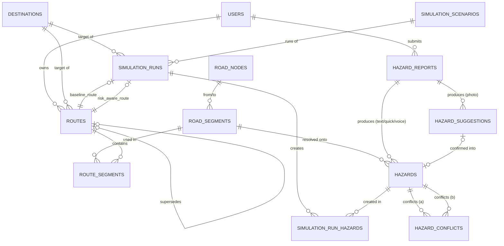

# QuakeRoute — Database Schema (MVP)

## 0. Document Status and Source of Truth

- **Source of truth:** `SRS.md`, `Domain-Risk-Model.md`, `API-Specification.md`. This document translates domain entities (Domain-Risk-Model §2–§16) and the API contract (API-Specification §3–§8) into a PostgreSQL + PostGIS database schema that can be implemented for the MVP.
- **What this document does not do:** change requirements (SRS), domain entities or risk-model formulas (Domain-Risk-Model), or endpoint contracts (API-Specification). All numeric parameters marked `TBD` in the source documents (severity weight, confidence factor, uncertainty weight, staleness decay, default quick-tap confidence, etc.) remain `TBD` here — the schema only provides a *place* for those values, not the values themselves.
- **Database:** PostgreSQL with the **PostGIS** extension (for spatial columns and `GIST` indexes). Spatial column types use `geography(...,4326)` — not `geometry` — so that distance/segment-length calculations (`ST_Length`, `ST_Distance`) return meters directly without manual projection, which is safer for a 10-day hackathon than handling a local projected SRID.
- **Primary key:** all tables use `UUID` (`gen_random_uuid()` / `pgcrypto` extension) to remain consistent with string-typed `*_id` identifiers in the API Specification and to be safe as public identifiers.
- **Design principle:** this schema intentionally **does not** store aggregate values that could become stale (e.g., "current road impact of a segment" or "current segment risk") as persisted columns — those values are computed by the Risk/Routing Module from currently active hazards (Domain-Risk-Model §9.2, §13), calculated when needed, not cached in a way that risks going stale. This is consistent with the *avoid over-engineering* rule.

---

## 1. ERD (Concise)

*Note:* this diagram shows conceptual cardinality; foreign-key details are in Section 2.

---

## 2. Entity Definitions

### 2.1 `users`

**Purpose:** lightweight identity per session/device, since complex authentication is explicitly **TBD** and out of scope for the MVP (API-Specification §1: `X-Session-Id`). This table is only needed as the owner of `routes` (for `GET /routes/active`), not as an account system.

| Column | Type | Description |
|---|---|---|
| `id` | `UUID` **PK** | |
| `session_id` | `VARCHAR(128)` **UNIQUE NOT NULL** | Value from the `X-Session-Id` header; the generation mechanism itself is **TBD** (API-Specification §1). |
| `device_id` | `VARCHAR(128)` NULL | Optional, if the client sends a device identifier separate from the session. |
| `created_at` | `TIMESTAMPTZ NOT NULL DEFAULT now()` | |
| `last_seen_at` | `TIMESTAMPTZ NOT NULL DEFAULT now()` | Updated on every request that carries a valid `X-Session-Id`. |

**Intentional decision — user location is not stored persistently:** every endpoint that needs the user's location (`POST /routes`, `POST /simulation/.../run`) sends `origin` per-request (API-Specification §6.1, §8.2). No requirement (SRS/API) asks for user location history to be stored on the server. Adding a `last_known_location` column without a clear consumer is over-engineering — **not created in this MVP**. If that need arises (e.g., live location sharing), it is **TBD** for a future schema revision.

---

### 2.2 `road_nodes`

**Purpose:** nodes (intersections/endpoints) on the controlled road network — needed as graph topology for routing (SRS §4.9; Domain-Risk-Model §9.1). The API does not expose nodes directly, but the routing engine (implementation `TBD`, FR-034) needs a valid node–edge graph to operate.

| Column | Type | Description |
|---|---|---|
| `id` | `UUID` **PK** | |
| `geom` | `geography(Point,4326) NOT NULL` | Node location. |
| `label` | `VARCHAR(255)` NULL | Optional, intersection name for debugging/demo of the simulation. |
| `created_at` | `TIMESTAMPTZ NOT NULL DEFAULT now()` | |

**Index:** `GIST (geom)`.

---

### 2.3 `road_segments`

**Purpose:** edges on the road network — the unit reasoned about by the routing engine, with a `Base Travel Cost` independent of hazards (Domain-Risk-Model §9.1, §13.2). This is the `road_segment_id` referenced in `GET /hazards`, `POST /routes`, etc.

| Column | Type | Description |
|---|---|---|
| `id` | `UUID` **PK** | = `road_segment_id` in the API. |
| `from_node_id` | `UUID` **FK → `road_nodes.id`**, NOT NULL | |
| `to_node_id` | `UUID` **FK → `road_nodes.id`**, NOT NULL | |
| `geom` | `geography(LineString,4326) NOT NULL` | Segment geometry. |
| `base_travel_cost` | `NUMERIC(10,2) NOT NULL` | Base distance/time cost, independent of hazards (Domain-Risk-Model §13.2). |
| `length_m` | `NUMERIC(10,2)` NULL | Optional; can be computed via `ST_Length(geom)` on the fly, stored only if needed for query performance. |
| `bidirectional` | `BOOLEAN NOT NULL DEFAULT true` | Whether the segment is traversable in both directions. Default assumption for the MVP — **TBD** if the road network needs one-way support. |
| `created_at` / `updated_at` | `TIMESTAMPTZ NOT NULL DEFAULT now()` | |

**Constraints:**
- `CHECK (from_node_id <> to_node_id)` — no self-loops.
- `CHECK (base_travel_cost >= 0)`.

**Indexes:** `GIST (geom)`, `btree (from_node_id)`, `btree (to_node_id)`.

**Important design note:** this table **does not** store columns such as `current_road_impact` or `current_risk`. Those values are aggregates over active hazards on the segment (Domain-Risk-Model §9.2 "worst-of", §10 "Max aggregation") and must always be computed from `hazards` when needed (at routing time or when rendering the map) — not stored as a cache, to avoid out-of-sync state.

---

### 2.4 `destinations`

**Purpose:** shelters and medical facilities that the user can select as a destination (FR-002, FR-005; API-Specification §5).

| Column | Type | Description |
|---|---|---|
| `id` | `UUID` **PK** | = `destination_id`. |
| `name` | `VARCHAR(255) NOT NULL` | |
| `type` | `VARCHAR(20) NOT NULL` | `CHECK (type IN ('Shelter','MedicalFacility'))`. |
| `geom` | `geography(Point,4326) NOT NULL` | |
| `nearest_road_node_id` | `UUID` NULL **FK → `road_nodes.id`** | Anchor the destination to the routing graph. Conceptually optional (could be computed via `ST_ClosestPoint` on the fly), stored as a lightweight cache to speed up MVP routing. |
| `created_at` / `updated_at` | `TIMESTAMPTZ NOT NULL DEFAULT now()` | |

**Indexes:** `GIST (geom)`, `btree (type)`.

---

### 2.5 `hazard_reports` (Observation)

**Purpose:** represents the **Observation** entity (Domain-Risk-Model §2.1, §3) — raw user input before it becomes a structured Hazard. Needed so that (a) a single text report can produce >1 hazard without duplicating evidence (FR-016), and (b) all reporting modes can be tracked through the same pipeline (FR-009).

| Column | Type | Description |
|---|---|---|
| `id` | `UUID` **PK** | |
| `user_id` | `UUID` NULL **FK → `users.id`** | Reporter; nullable because user identity itself is **TBD** at the API level. |
| `mode` | `VARCHAR(20) NOT NULL` | `CHECK (mode IN ('Photo','Text','QuickTap','Voice'))` — per the 4 reporting modes SRS §4.3–§4.6. |
| `raw_text` | `TEXT` NULL | For `Text` mode, or transcript for `Voice` mode (FR-023). |
| `photo_url` | `VARCHAR(500)` NULL | For `Photo` mode. |
| `audio_url` | `VARCHAR(500)` NULL | For `Voice` mode. |
| `note` | `TEXT` NULL | Optional additional note (field `note` in API §3.1). |
| `location` | `geography(Point,4326) NOT NULL` | Location sent by the reporter. |
| `created_at` | `TIMESTAMPTZ NOT NULL DEFAULT now()` | |

**Constraint:** `CHECK` — at least one of `raw_text`, `photo_url`, `audio_url` is populated, consistent with `mode` (e.g., `mode='Photo'` → `photo_url` is required). For `QuickTap`, all three may be `NULL` (its evidence is the selected `type`, stored directly in `hazards`).

**Indexes:** `GIST (location)`, `btree (mode)`, `btree (created_at)`.

---

### 2.6 `hazard_suggestions`

**Purpose:** AI Vision proposal for a photo, pending user confirmation, **not yet** an active Hazard (FR-012, FR-013, FR-025; API-Specification §3.1–§3.3). Only the photo path goes through this table — text, quick-tap, and voice become `hazards` directly (API §3.4–§3.6).

| Column | Type | Description |
|---|---|---|
| `id` | `UUID` **PK** | = `suggestion_id`. |
| `hazard_report_id` | `UUID NOT NULL` **FK → `hazard_reports.id`** | |
| `status` | `VARCHAR(20) NOT NULL DEFAULT 'PendingConfirmation'` | `CHECK (status IN ('PendingConfirmation','Confirmed','Rejected'))`. |
| `proposed_type` | `VARCHAR(30) NOT NULL` | See `hazard_type` enum (Section 3). |
| `proposed_severity` | `VARCHAR(10) NOT NULL` | See `severity` enum. |
| `proposed_confidence` | `NUMERIC(4,3) NOT NULL` | `CHECK (proposed_confidence BETWEEN 0 AND 1)`. |
| `proposed_road_impact` | `VARCHAR(20) NOT NULL` | See `road_impact` enum. |
| `resulting_hazard_id` | `UUID` NULL **FK → `hazards.id`** | Populated after `confirm` (§3.2). Remains `NULL` if `Rejected`. |
| `created_at` | `TIMESTAMPTZ NOT NULL DEFAULT now()` | |
| `resolved_at` | `TIMESTAMPTZ` NULL | Time of confirm/reject — used by the application to prevent double resolution (`409 Conflict`, API §3.2/§3.3). |

**Indexes:** `btree (status)`, `btree (hazard_report_id)`.

---

### 2.7 `hazards`

**Purpose:** core entity — structured, routable hazard record (Domain-Risk-Model §3; SRS §1.4). This is the single source of data for the Dynamic Safety Map (FR-001–FR-004) and the Risk Model input (FR-030–FR-031).

| Column | Type | Description |
|---|---|---|
| `id` | `UUID` **PK** | = `hazard_id`. |
| `hazard_report_id` | `UUID` NULL **FK → `hazard_reports.id`** | Provenance to the original Observation. |
| `hazard_suggestion_id` | `UUID` NULL **FK → `hazard_suggestions.id`** | Populated only if originating from a confirmed photo flow. |
| `type` | `VARCHAR(30) NOT NULL` | `hazard_type` enum (6 MVP types). |
| `severity` | `VARCHAR(10) NOT NULL` | `severity` enum (`Low`/`Medium`/`High`) — final band count/labels **TBD** (Domain-Risk-Model §4.2). |
| `confidence` | `NUMERIC(4,3) NOT NULL` | `CHECK (confidence BETWEEN 0 AND 1)` (FR-026). |
| `road_impact` | `VARCHAR(20) NOT NULL` | `road_impact` enum. |
| `status` | `VARCHAR(30) NOT NULL DEFAULT 'Reported'` | `hazard_status` enum (FR-027). |
| `source` | `VARCHAR(30) NOT NULL` | `hazard_source` enum. |
| `location` | `geography(Point,4326) NOT NULL` | |
| `road_segment_id` | `UUID` NULL **FK → `road_segments.id`** | Result of spatial resolution from location → nearest segment (internal process, API-Specification §1: "Location → Road Segment resolution is an internal PostGIS process"). `NULL` if resolution has not yet succeeded or failed. |
| `evidence_photo_url` | `VARCHAR(500)` NULL | Cached evidence for fast access (FR-014, Domain-Risk-Model §6); the original source remains in `hazard_reports`/`hazard_suggestions`. |
| `evidence_text` | `TEXT` NULL | |
| `reported_at` | `TIMESTAMPTZ NOT NULL DEFAULT now()` | `Timestamp` field (Domain-Risk-Model §3) — basis for staleness handling (§11.3, **TBD** decay formula). |
| `updated_at` | `TIMESTAMPTZ NOT NULL DEFAULT now()` | Changes when status/confidence changes (FR-028). |

**Constraints:**
- `CHECK (type IN ('DebrisRubble','RoadBlockage','Fire','Flood','ElectricalHazard','VisibleBuildingDamage'))`.
- `CHECK (severity IN ('Low','Medium','High'))`.
- `CHECK (road_impact IN ('Passable','PartiallyBlocked','Blocked'))`.
- `CHECK (status IN ('Reported','Confirmed','UncertainConflicting'))`.
- `CHECK (source IN ('AIVisionPhoto','AITextExtraction','QuickTap','AIVoiceExtraction'))`.

**Indexes:** `GIST (location)`, `btree (road_segment_id)`, `btree (status)`, `btree (type)`, `btree (updated_at)` (for `updated_since` queries, API §4.1).

> Columns use `VARCHAR + CHECK`, not native Postgres `ENUM`, because several value sets (`severity`, `status`) are still explicitly **TBD** in the source documents — a `CHECK constraint` is easier to change (`ALTER TABLE ... DROP/ADD CONSTRAINT`) than `ALTER TYPE` on a native `ENUM` during a 10-day iteration.

---

### 2.8 `hazard_conflicts`

**Purpose:** represents pairs of hazards that conflict on the same segment (FR-038; field `conflicting_with` in `GET /hazards/{hazard_id}`, API §4.2).

| Column | Type | Description |
|---|---|---|
| `id` | `UUID` **PK** | |
| `hazard_id_a` | `UUID NOT NULL` **FK → `hazards.id`** | |
| `hazard_id_b` | `UUID NOT NULL` **FK → `hazards.id`** | |
| `detected_at` | `TIMESTAMPTZ NOT NULL DEFAULT now()` | |

**Constraints:**
- `CHECK (hazard_id_a <> hazard_id_b)`.
- `CHECK (hazard_id_a < hazard_id_b)` — ensures consistent ordering so a pair is stored only once (the application writing this row must sort IDs before insert).
- `UNIQUE (hazard_id_a, hazard_id_b)`.

**Indexes:** `btree (hazard_id_a)`, `btree (hazard_id_b)`.

> The definition of "material disagreement" that triggers a row in this table remains **TBD** (Domain-Risk-Model §11.2) — the schema only provides a place to store the *result* of conflict detection, not the logic.

---

### 2.9 `routes`

**Purpose:** route computed by the Routing Module — whether an initial route (FR-006), a destination-replacement route (FR-007), or a recalculated route (FR-036) (API-Specification §6.1–§6.3).

| Column | Type | Description |
|---|---|---|
| `id` | `UUID` **PK** | = `route_id`. |
| `user_id` | `UUID` NULL **FK → `users.id`** | `NULL` for routes created from Emergency Simulation (§2.12), which are not owned by any session user. |
| `destination_id` | `UUID NOT NULL` **FK → `destinations.id`** | |
| `origin` | `geography(Point,4326) NOT NULL` | User location at route creation time (FR-001). |
| `status` | `VARCHAR(20) NOT NULL DEFAULT 'Active'` | `CHECK (status IN ('Active','Superseded'))`. |
| `supersedes_route_id` | `UUID` NULL **FK → `routes.id`** (self) | Previously active route replaced by this route (FR-007, FR-037). |
| `total_cost` | `NUMERIC(12,2) NOT NULL` | Σ `segment_routing_cost` (Domain-Risk-Model §16.2). |
| `created_at` | `TIMESTAMPTZ NOT NULL DEFAULT now()` | |
| `superseded_at` | `TIMESTAMPTZ` NULL | Populated when this route is replaced by another route. |

**Constraint:**
- **Partial unique index:** `UNIQUE (user_id) WHERE status = 'Active'` — ensures at most one active route per user, supporting `GET /routes/active` and the "replace previous route" behavior (FR-007). Rows with `user_id NULL` (simulation routes) are not affected by this index because Postgres treats `NULL` as distinct in unique indexes.

**Indexes:** `btree (user_id, status)`, `btree (destination_id)`.

> **`superseded_by_route_id`** appearing in the `GET /routes/{route_id}` response (API §6.2) is **not** stored as a separate column — its value is derived via the query `SELECT id FROM routes WHERE supersedes_route_id = :route_id`, to avoid two columns that must stay synchronized.

---

### 2.10 `route_segments`

**Purpose:** snapshot of segments and cost breakdown at the time a route was computed (Domain-Risk-Model §13.2, §16.2; API §6.1–§6.2). A snapshot is required because a segment's hazard cost can change over time (FR-028), while already-created routes must remain displayable as they were when created, including for baseline vs. risk-aware comparison (FR-044).

| Column | Type | Description |
|---|---|---|
| `id` | `UUID` **PK** | |
| `route_id` | `UUID NOT NULL` **FK → `routes.id` ON DELETE CASCADE** | |
| `road_segment_id` | `UUID NOT NULL` **FK → `road_segments.id`** | |
| `sequence_order` | `INTEGER NOT NULL` | Order of segments in the route, from origin to destination. |
| `base_travel_cost` | `NUMERIC(10,2) NOT NULL` | |
| `hazard_penalty` | `NUMERIC(10,2) NOT NULL DEFAULT 0` | |
| `uncertainty_penalty` | `NUMERIC(10,2) NOT NULL DEFAULT 0` | |
| `segment_routing_cost` | `NUMERIC(10,2) NOT NULL` | = `base_travel_cost + hazard_penalty + uncertainty_penalty` (Domain-Risk-Model §13.2). Stored explicitly (not just computed in a query) so the per-segment breakdown can be returned directly in the API §6.1 response. |

**Constraint:** `UNIQUE (route_id, sequence_order)`.
**Indexes:** `btree (route_id, sequence_order)`, `btree (road_segment_id)`.

---

### 2.11 `simulation_scenarios`

**Purpose:** the 6 controlled scenarios supported by Emergency Simulation (FR-041, FR-043; API §8.1). Reference/seed data, not created by the user at runtime.

| Column | Type | Description |
|---|---|---|
| `scenario_key` | `VARCHAR(50)` **PK** | Stable slug, same as `scenario_id` in the API (e.g., `blocked_road`). |
| `name` | `VARCHAR(100) NOT NULL` | E.g., "Blocked Road". |
| `description` | `TEXT` NULL | |
| `injected_observations` | `JSONB NOT NULL` | List of fixed Observations/hazards injected when the scenario runs (Architecture Document §8: "fixed data in the Simulation Module", not part of the `POST /simulation/scenarios/{id}/run` request). Internal JSON structure is **TBD**, determined during Simulation Module implementation. |
| `created_at` | `TIMESTAMPTZ NOT NULL DEFAULT now()` | |

**Seed data (6 fixed rows, per API §8.1):** `no_hazard`, `blocked_road`, `high_risk_hazard`, `new_hazard_during_navigation`, `conflicting_reports`, `ai_vision_hazard_report`.

---

### 2.12 `simulation_runs`

**Purpose:** execution of a scenario, producing a baseline route and a risk-aware route for comparison (FR-042, FR-044; API §8.2–§8.3).

| Column | Type | Description |
|---|---|---|
| `id` | `UUID` **PK** | = `run_id`. |
| `scenario_key` | `VARCHAR(50) NOT NULL` **FK → `simulation_scenarios.scenario_key`** | |
| `origin` | `geography(Point,4326) NOT NULL` | From the `POST /simulation/scenarios/{id}/run` request (API §8.2). |
| `destination_id` | `UUID NOT NULL` **FK → `destinations.id`** | |
| `status` | `VARCHAR(20) NOT NULL DEFAULT 'Running'` | `CHECK (status IN ('Running','Completed','Failed'))`. `Failed` is added to handle AI/routing provider failures (API §2, `502/503`) — not explicitly mentioned in API-Specification §8 but consistent with the common error format in §2. |
| `baseline_route_id` | `UUID` NULL **FK → `routes.id`** | Route with `hazard_penalty = 0` and `uncertainty_penalty = 0` on all its `route_segments` (API §8.3 note: "Base Travel Cost only"). **Not** a separate table — reuses `routes`, consistent with Architecture Document §8 "same cost graph". |
| `risk_aware_route_id` | `UUID` NULL **FK → `routes.id`** | |
| `started_at` | `TIMESTAMPTZ NOT NULL DEFAULT now()` | |
| `completed_at` | `TIMESTAMPTZ` NULL | |

**Indexes:** `btree (scenario_key)`, `btree (status)`.

---

### 2.13 `simulation_run_hazards`

**Purpose:** track hazards created during a run (field `hazards_created` in API §8.3).

| Column | Type | Description |
|---|---|---|
| `id` | `UUID` **PK** | |
| `simulation_run_id` | `UUID NOT NULL` **FK → `simulation_runs.id` ON DELETE CASCADE** | |
| `hazard_id` | `UUID NOT NULL` **FK → `hazards.id`** | |

**Constraint:** `UNIQUE (simulation_run_id, hazard_id)`.
**Index:** `btree (simulation_run_id)`.

---

## 3. Enum / Status Reference

All values below are taken directly from API-Specification §1 and the Domain-Risk-Model, enforced as `CHECK` constraints (not native `ENUM`) for flexibility while values remain **TBD**:

| Enum | Values | Used In |
|---|---|---|
| `hazard_type` | `DebrisRubble`, `RoadBlockage`, `Fire`, `Flood`, `ElectricalHazard`, `VisibleBuildingDamage` | `hazards.type`, `hazard_suggestions.proposed_type` |
| `severity` | `Low`, `Medium`, `High` (*final band count/labels TBD*, Domain-Risk-Model §4.2) | `hazards.severity`, `hazard_suggestions.proposed_severity` |
| `road_impact` | `Passable`, `PartiallyBlocked`, `Blocked` | `hazards.road_impact`, `hazard_suggestions.proposed_road_impact` |
| `hazard_status` | `Reported`, `Confirmed`, `UncertainConflicting` (*final set TBD — SRS also mentions "Verified" conceptually, not yet mapped to the API*, FR-027) | `hazards.status` |
| `hazard_source` | `AIVisionPhoto`, `AITextExtraction`, `QuickTap`, `AIVoiceExtraction` | `hazards.source` |
| `report_mode` | `Photo`, `Text`, `QuickTap`, `Voice` | `hazard_reports.mode` |
| `suggestion_status` | `PendingConfirmation`, `Confirmed`, `Rejected` | `hazard_suggestions.status` |
| `destination_type` | `Shelter`, `MedicalFacility` | `destinations.type` |
| `route_status` | `Active`, `Superseded` | `routes.status` |
| `simulation_run_status` | `Running`, `Completed`, `Failed` | `simulation_runs.status` |

---

## 4. Spatial Design (PostGIS)

| Aspect | Decision |
|---|---|
| **SRID** | `4326` (WGS84 lat/lng) on all spatial columns, consistent with the `{ "lat", "lng" }` format in API-Specification §1. |
| **Column type** | `geography`, not `geometry` — so that `ST_Length`, `ST_Distance`, and radius searches return meters directly without manual projection (simpler for a 10-day build; trade-off: slightly heavier computationally than projected `geometry`, considered acceptable for the MVP's controlled road network scale). |
| **Indexes** | `GIST` on every `geography`/`geometry` column (`road_nodes.geom`, `road_segments.geom`, `destinations.geom`, `hazard_reports.location`, `hazards.location`, `routes.origin`, `simulation_runs.origin`). |
| **`bbox` filter** (`GET /hazards`, `GET /destinations`, API §4.1, §5.1) | Implemented with `ST_Intersects(location, ST_MakeEnvelope(minLng, minLat, maxLng, maxLat, 4326)::geography)`, leveraging the `GIST` indexes above. |
| **Location → Road Segment resolution** | Internal process (API §1) — performed with `ST_ClosestPoint`/`ST_Distance` against `road_segments.geom` when a hazard is created, result stored in `hazards.road_segment_id`. The specific algorithm for "nearest segment" (maximum radius, tie-breaking) is **TBD**. |
| **Routing graph** | `road_nodes` + `road_segments` form a standard edge-node graph. This schema does not lock in a routing library/algorithm (e.g., pgRouting) — per FR-034, that remains **TBD**/implementation detail; the schema only provides a topological data structure sufficient for *any* algorithm chosen. |

---

## 5. Relationship Summary

| From | To | Cardinality | Notes |
|---|---|---|---|
| `users` → `hazard_reports` | 1 → N | One user can submit many observations. |
| `users` → `routes` | 1 → N (but max 1 `Active`) | Enforced via partial unique index (§2.9). |
| `hazard_reports` → `hazard_suggestions` | 1 → N | Only for `mode='Photo'`; in practice typically 1 → 1. |
| `hazard_reports` → `hazards` | 1 → N | One text report can produce >1 hazard (FR-016). |
| `hazard_suggestions` → `hazards` | 1 → 0..1 | Populated only after confirmation. |
| `hazards` ↔ `hazards` (via `hazard_conflicts`) | N ↔ N | Pairs of hazards conflicting on the same segment. |
| `road_nodes` → `road_segments` | 1 → N (twice: `from`/`to`) | |
| `road_segments` → `hazards` | 1 → N | Result of spatial resolution. |
| `road_segments` → `route_segments` | 1 → N | One segment may appear in many different routes. |
| `routes` → `route_segments` | 1 → N | |
| `routes` → `routes` (via `supersedes_route_id`) | 0..1 → 0..1 | Recalculation/destination-change chain. |
| `destinations` → `routes` | 1 → N | |
| `simulation_scenarios` → `simulation_runs` | 1 → N | |
| `simulation_runs` → `routes` | 1 → 2 (baseline + risk-aware) | Via `baseline_route_id`, `risk_aware_route_id`. |
| `simulation_runs` → `hazards` (via `simulation_run_hazards`) | N ↔ N | Hazards created by a run. |

---

## 6. Constraint & Index Summary

| Table | Key Constraint | Additional Indexes |
|---|---|---|
| `users` | `UNIQUE(session_id)` | — |
| `road_nodes` | — | `GIST(geom)` |
| `road_segments` | `CHECK(from_node_id<>to_node_id)`, `CHECK(base_travel_cost>=0)` | `GIST(geom)`, `btree(from_node_id)`, `btree(to_node_id)` |
| `destinations` | `CHECK(type IN (...))` | `GIST(geom)`, `btree(type)` |
| `hazard_reports` | `CHECK` evidence consistent with `mode` | `GIST(location)`, `btree(mode)`, `btree(created_at)` |
| `hazard_suggestions` | `CHECK(status IN (...))` | `btree(status)`, `btree(hazard_report_id)` |
| `hazards` | `CHECK` on `type`/`severity`/`road_impact`/`status`/`source`, `CHECK(confidence BETWEEN 0 AND 1)` | `GIST(location)`, `btree(road_segment_id)`, `btree(status)`, `btree(type)`, `btree(updated_at)` |
| `hazard_conflicts` | `UNIQUE(hazard_id_a, hazard_id_b)`, `CHECK(hazard_id_a < hazard_id_b)` | `btree(hazard_id_a)`, `btree(hazard_id_b)` |
| `routes` | `UNIQUE(user_id) WHERE status='Active'` (partial), `CHECK(status IN (...))` | `btree(user_id,status)`, `btree(destination_id)` |
| `route_segments` | `UNIQUE(route_id, sequence_order)` | `btree(route_id,sequence_order)`, `btree(road_segment_id)` |
| `simulation_scenarios` | `PK(scenario_key)` | — |
| `simulation_runs` | `CHECK(status IN (...))` | `btree(scenario_key)`, `btree(status)` |
| `simulation_run_hazards` | `UNIQUE(simulation_run_id, hazard_id)` | `btree(simulation_run_id)` |

---

## 7. Mapping: Database Entity → API Endpoint

| Endpoint (API-Specification) | Tables Involved |
|---|---|
| `POST /hazard-reports/photo` (§3.1) | INSERT `hazard_reports` (mode=Photo) → INSERT `hazard_suggestions` (status=PendingConfirmation) |
| `POST /hazard-suggestions/{id}/confirm` (§3.2) | UPDATE `hazard_suggestions` (status=Confirmed) → INSERT `hazards` (with `hazard_suggestion_id` populated) |
| `POST /hazard-suggestions/{id}/reject` (§3.3) | UPDATE `hazard_suggestions` (status=Rejected) |
| `POST /hazard-reports/text` (§3.4) | INSERT `hazard_reports` (mode=Text) → INSERT `hazards` (1..N rows, `source=AITextExtraction`) |
| `POST /hazard-reports/quick` (§3.5) | INSERT `hazard_reports` (mode=QuickTap, empty evidence) → INSERT `hazards` (`source=QuickTap`) |
| `POST /hazard-reports/voice` (§3.6) | INSERT `hazard_reports` (mode=Voice) → INSERT `hazards` (`source=AIVoiceExtraction`) |
| `GET /hazards` (§4.1) | SELECT `hazards` (filter `bbox` via `GIST`, `status`, `updated_since` via `btree(updated_at)`) |
| `GET /hazards/{hazard_id}` (§4.2) | SELECT `hazards` + SELECT `hazard_conflicts` (for field `conflicting_with`) |
| `GET /destinations` (§5.1) | SELECT `destinations` (filter `bbox` via `GIST`) |
| `POST /routes` (§6.1) | SELECT graph `road_nodes`/`road_segments` + active hazards → INSERT `routes` + INSERT `route_segments` (N rows) |
| `GET /routes/{route_id}` (§6.2) | SELECT `routes` + `route_segments`; `superseded_by_route_id` via subquery on `supersedes_route_id` |
| `GET /routes/active` (§6.3) | SELECT `routes` WHERE `user_id=:id AND status='Active'` |
| Uncertain/Conflicting fields (§7) | `hazards.status='UncertainConflicting'`, `route_segments.uncertainty_penalty`, `hazard_conflicts` |
| `GET /simulation/scenarios` (§8.1) | SELECT `simulation_scenarios` |
| `POST /simulation/scenarios/{id}/run` (§8.2) | INSERT `simulation_runs` (status=Running) → (async) replay `injected_observations` through the normal path §3–§6 |
| `GET /simulation/runs/{run_id}` (§8.3) | SELECT `simulation_runs` + `simulation_run_hazards` (join `hazards`) + `routes` (baseline & risk-aware) via `baseline_route_id`/`risk_aware_route_id` |

---

## 8. What Is Intentionally Not Created (Out of Scope)

Consistent with the Rules in the brief and §10 of API-Specification / §11 of SRS:

- **No authentication/authorization tables** (role, permission, password, etc.) — user identity remains a lightweight identifier (`users.session_id`), actual mechanism is **TBD**.
- **No dashboard/coordinator tables** — Volunteers/Coordinators use the same Evacuee/Community Reporter capabilities (SRS §3.3); no separate domain entity exists for this role.
- **No AI provider-specific data** (model name, raw provider request/response, API key, etc.) stored in this schema — only AI *results* (type/severity/confidence/road_impact) relevant to the domain, per the constraint "do not store unnecessary AI provider-specific data". If provider audit/debugging is needed, that is an application observability/logging concern, not part of the domain schema.
- **No risk-model parameter table** (`severity_weight`, `confidence_factor`, `uncertainty_weight`, etc.) as a database table — these values are explicitly **TBD** in Domain-Risk-Model §14–§15 and are recommended to be stored as application configuration (constants/`.env`), not a table, unless the need to tune parameters at runtime without redeploying emerges later (**TBD**, out of scope for now).
- **No multi-disaster / hazard types beyond the 6 MVP types** — `hazard_type` is `CHECK`-constrained to 6 fixed values (SRS §11).
- **No aggregate cache columns** (`current_road_impact`, `current_risk`) on `road_segments` — see note in §2.3.
- **No separate evidence table / standalone "view evidence" feature** — evidence remains as columns on `hazards` (`evidence_photo_url`, `evidence_text`), per API-Specification §10.

---

## 9. Summary of `TBD` Items

All of the following are `TBD` items **inherited** from source documents (not new decisions made in this document):

| Item | Source |
|---|---|
| `session_id`/`device_id` mechanism (lightweight authentication) | API-Specification §1 |
| Final `severity` band count and labels | Domain-Risk-Model §4.2 |
| Final `hazard_status` set (whether `Verified` is separate from `Confirmed`) | SRS FR-027; Domain-Risk-Model §7.1 |
| Numeric definition of "material disagreement" between reports | Domain-Risk-Model §11.2 |
| Staleness/decay formula for confidence over time | Domain-Risk-Model §11.3 |
| Default `severity`/`confidence`/`road_impact` for quick-tap reports | Domain-Risk-Model §4.1, §5.1; API-Specification §3.5 |
| `severity_weight`, `confidence_factor`, `uncertainty_weight` values | Domain-Risk-Model §14–§15 |
| Multi-hazard aggregation rule per segment (Max vs. Sum) — Max recommended, not yet final | Domain-Risk-Model §10 |
| Real-time update delivery mechanism (polling vs. push) for `GET /routes/active` and `GET /simulation/runs/{id}` | API-Specification §6.3, §8.3 |
| Radius/rules for Location → nearest Road Segment resolution | API-Specification §1 (explained in this document in §4) |

---

**Document status:** Database Schema for the QuakeRoute 10-day hackathon MVP, derived from `SRS.md`, `Domain-Risk-Model.md`, and `API-Specification.md`. No requirement, domain entity, risk-model formula, or endpoint contract has been changed by this document. This schema covers only MVP needs; no tables exist for out-of-scope features. Items marked `TBD` in the source documents remain `TBD` here.
