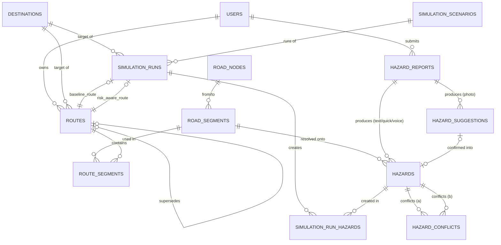

# QuakeRoute — Database Schema (MVP)

## 0. Status Dokumen dan Sumber Kebenaran

- **Source of truth:** `SRS.md`, `Domain-Risk-Model.md`, `API-Specification.md`. Dokumen ini menerjemahkan entitas domain (Domain-Risk-Model §2–§16) dan kontrak API (API-Specification §3–§8) menjadi skema database PostgreSQL + PostGIS yang dapat diimplementasikan untuk MVP.
- **Yang tidak dilakukan dokumen ini:** mengubah requirement (SRS), entitas atau formula risk model (Domain-Risk-Model), atau kontrak endpoint (API-Specification). Semua parameter numerik yang ditandai `TBD` di dokumen sumber (severity weight, confidence factor, uncertainty weight, staleness decay, default confidence quick-tap, dsb.) tetap `TBD` di sini — skema hanya menyediakan *tempat* untuk nilai tersebut, bukan nilainya.
- **Database:** PostgreSQL dengan ekstensi **PostGIS** (untuk kolom spasial dan indeks `GIST`). Tipe kolom spasial menggunakan `geography(...,4326)` — bukan `geometry` — supaya perhitungan jarak/panjang segmen (`ST_Length`, `ST_Distance`) langsung dalam meter tanpa proyeksi manual, yang lebih aman untuk 10 hari hackathon dibanding mengurus SRID proyeksi lokal.
- **Primary key:** seluruh tabel menggunakan `UUID` (`gen_random_uuid()` / ekstensi `pgcrypto`) agar konsisten dengan `*_id` bertipe string pada API Specification, dan aman digunakan sebagai identifier publik.
- **Prinsip desain:** skema ini sengaja **tidak** menyimpan nilai agregat yang bisa basi (mis. "road impact segmen saat ini" atau "total risk segmen") sebagai kolom tersimpan — nilai-nilai itu adalah hasil komputasi Risk/Routing Module dari hazard aktif saat itu (Domain-Risk-Model §9.2, §13), dihitung saat dibutuhkan, bukan disimpan sebagai cache yang berisiko stale. Ini konsisten dengan aturan *hindari over-engineering*.

---

## 1. ERD (Ringkas)

*Catatan:* diagram ini menunjukkan kardinalitas konseptual; detail foreign key ada di Bagian 2.

---

## 2. Entity Definitions

### 2.1 `users`

**Tujuan:** identitas ringan per sesi/perangkat, karena autentikasi kompleks eksplisit **TBD** dan di luar scope MVP (API-Specification §1: `X-Session-Id`). Tabel ini hanya diperlukan sebagai pemilik `routes` (untuk `GET /routes/active`), bukan sebagai sistem akun.

| Kolom | Tipe | Keterangan |
|---|---|---|
| `id` | `UUID` **PK** | |
| `session_id` | `VARCHAR(128)` **UNIQUE NOT NULL** | Nilai dari header `X-Session-Id`; mekanisme pembuatannya sendiri **TBD** (API-Specification §1). |
| `device_id` | `VARCHAR(128)` NULL | Opsional, jika client mengirim identifier perangkat terpisah dari session. |
| `created_at` | `TIMESTAMPTZ NOT NULL DEFAULT now()` | |
| `last_seen_at` | `TIMESTAMPTZ NOT NULL DEFAULT now()` | Diperbarui setiap request yang membawa `X-Session-Id` valid. |

**Keputusan yang disengaja — lokasi pengguna tidak disimpan persisten:** setiap endpoint yang butuh lokasi user (`POST /routes`, `POST /simulation/.../run`) mengirim `origin` per-request (API-Specification §6.1, §8.2). Tidak ada requirement (SRS/API) yang meminta riwayat lokasi user tersimpan di server. Menambah kolom `last_known_location` tanpa konsumen yang jelas adalah over-engineering — **tidak dibuat di MVP ini**. Jika kebutuhan itu muncul (mis. live location sharing), ini **TBD** untuk revisi skema berikutnya.

---

### 2.2 `road_nodes`

**Tujuan:** simpul (persimpangan/titik ujung) pada jaringan jalan terkontrol — dibutuhkan sebagai topologi graph untuk routing (SRS §4.9; Domain-Risk-Model §9.1). Endpoint API tidak mengekspos node secara langsung, tapi routing engine (implementasi `TBD`, FR-034) butuh graph node–edge yang valid untuk beroperasi.

| Kolom | Tipe | Keterangan |
|---|---|---|
| `id` | `UUID` **PK** | |
| `geom` | `geography(Point,4326) NOT NULL` | Lokasi node. |
| `label` | `VARCHAR(255)` NULL | Opsional, nama persimpangan untuk debugging/demo simulasi. |
| `created_at` | `TIMESTAMPTZ NOT NULL DEFAULT now()` | |

**Index:** `GIST (geom)`.

---

### 2.3 `road_segments`

**Tujuan:** edge pada jaringan jalan — unit yang direasoning oleh routing engine, memiliki `Base Travel Cost` independen dari hazard (Domain-Risk-Model §9.1, §13.2). Ini adalah `road_segment_id` yang direferensikan di `GET /hazards`, `POST /routes`, dsb.

| Kolom | Tipe | Keterangan |
|---|---|---|
| `id` | `UUID` **PK** | = `road_segment_id` pada API. |
| `from_node_id` | `UUID` **FK → `road_nodes.id`**, NOT NULL | |
| `to_node_id` | `UUID` **FK → `road_nodes.id`**, NOT NULL | |
| `geom` | `geography(LineString,4326) NOT NULL` | Geometri segmen. |
| `base_travel_cost` | `NUMERIC(10,2) NOT NULL` | Biaya dasar jarak/waktu, independen hazard (Domain-Risk-Model §13.2). |
| `length_m` | `NUMERIC(10,2)` NULL | Opsional; bisa dihitung via `ST_Length(geom)` on the fly, disimpan hanya jika dibutuhkan untuk performa query. |
| `bidirectional` | `BOOLEAN NOT NULL DEFAULT true` | Apakah segmen bisa dilalui dua arah. Asumsi default untuk MVP — **TBD** jika jaringan jalan butuh arah satu jalur. |
| `created_at` / `updated_at` | `TIMESTAMPTZ NOT NULL DEFAULT now()` | |

**Constraint:**
- `CHECK (from_node_id <> to_node_id)` — tidak ada self-loop.
- `CHECK (base_travel_cost >= 0)`.

**Index:** `GIST (geom)`, `btree (from_node_id)`, `btree (to_node_id)`.

**Catatan desain penting:** tabel ini **tidak** menyimpan kolom seperti `current_road_impact` atau `current_risk`. Nilai itu adalah agregat atas hazard aktif pada segmen (Domain-Risk-Model §9.2 "worst-of", §10 "Max aggregation") dan harus selalu dihitung dari `hazards` saat dibutuhkan (saat routing atau saat render map) — bukan disimpan sebagai cache, untuk menghindari state yang tidak sinkron.

---

### 2.4 `destinations`

**Tujuan:** shelter dan fasilitas medis yang bisa dipilih user sebagai tujuan (FR-002, FR-005; API-Specification §5).

| Kolom | Tipe | Keterangan |
|---|---|---|
| `id` | `UUID` **PK** | = `destination_id`. |
| `name` | `VARCHAR(255) NOT NULL` | |
| `type` | `VARCHAR(20) NOT NULL` | `CHECK (type IN ('Shelter','MedicalFacility'))`. |
| `geom` | `geography(Point,4326) NOT NULL` | |
| `nearest_road_node_id` | `UUID` NULL **FK → `road_nodes.id`** | Anchor destinasi ke graph routing. Opsional secara konsep (bisa dihitung `ST_ClosestPoint` on the fly), disimpan sebagai cache ringan untuk mempercepat routing MVP. |
| `created_at` / `updated_at` | `TIMESTAMPTZ NOT NULL DEFAULT now()` | |

**Index:** `GIST (geom)`, `btree (type)`.

---

### 2.5 `hazard_reports` (Observation)

**Tujuan:** merepresentasikan entitas **Observation** (Domain-Risk-Model §2.1, §3) — input mentah dari user sebelum menjadi Hazard terstruktur. Diperlukan agar (a) satu laporan teks bisa menghasilkan >1 hazard tanpa duplikasi evidence (FR-016), dan (b) semua mode reporting bisa dilacak melalui satu pipeline yang sama (FR-009).

| Kolom | Tipe | Keterangan |
|---|---|---|
| `id` | `UUID` **PK** | |
| `user_id` | `UUID` NULL **FK → `users.id`** | Reporter; nullable karena identitas user sendiri **TBD** di level API. |
| `mode` | `VARCHAR(20) NOT NULL` | `CHECK (mode IN ('Photo','Text','QuickTap','Voice'))` — sesuai 4 mode reporting SRS §4.3–§4.6. |
| `raw_text` | `TEXT` NULL | Untuk mode `Text`, atau transkrip untuk mode `Voice` (FR-023). |
| `photo_url` | `VARCHAR(500)` NULL | Untuk mode `Photo`. |
| `audio_url` | `VARCHAR(500)` NULL | Untuk mode `Voice`. |
| `note` | `TEXT` NULL | Catatan tambahan opsional (field `note` pada API §3.1). |
| `location` | `geography(Point,4326) NOT NULL` | Lokasi yang dikirim reporter. |
| `created_at` | `TIMESTAMPTZ NOT NULL DEFAULT now()` | |

**Constraint:** `CHECK` — minimal satu dari `raw_text`, `photo_url`, `audio_url` terisi, konsisten dengan `mode` (mis. `mode='Photo'` → `photo_url` wajib terisi). Untuk `QuickTap`, ketiganya boleh `NULL` (evidence-nya adalah `type` yang dipilih, disimpan langsung di `hazards`).

**Index:** `GIST (location)`, `btree (mode)`, `btree (created_at)`.

---

### 2.6 `hazard_suggestions`

**Tujuan:** proposal AI Vision atas foto, menunggu konfirmasi user, **belum** menjadi Hazard aktif (FR-012, FR-013, FR-025; API-Specification §3.1–§3.3). Hanya jalur foto yang melalui tabel ini — teks, quick-tap, dan voice langsung menjadi `hazards` (API §3.4–§3.6).

| Kolom | Tipe | Keterangan |
|---|---|---|
| `id` | `UUID` **PK** | = `suggestion_id`. |
| `hazard_report_id` | `UUID NOT NULL` **FK → `hazard_reports.id`** | |
| `status` | `VARCHAR(20) NOT NULL DEFAULT 'PendingConfirmation'` | `CHECK (status IN ('PendingConfirmation','Confirmed','Rejected'))`. |
| `proposed_type` | `VARCHAR(30) NOT NULL` | Lihat enum `hazard_type` (Bagian 3). |
| `proposed_severity` | `VARCHAR(10) NOT NULL` | Lihat enum `severity`. |
| `proposed_confidence` | `NUMERIC(4,3) NOT NULL` | `CHECK (proposed_confidence BETWEEN 0 AND 1)`. |
| `proposed_road_impact` | `VARCHAR(20) NOT NULL` | Lihat enum `road_impact`. |
| `resulting_hazard_id` | `UUID` NULL **FK → `hazards.id`** | Diisi setelah `confirm` (§3.2). Tetap `NULL` jika `Rejected`. |
| `created_at` | `TIMESTAMPTZ NOT NULL DEFAULT now()` | |
| `resolved_at` | `TIMESTAMPTZ` NULL | Waktu confirm/reject — dipakai aplikasi untuk mencegah resolve ganda (`409 Conflict`, API §3.2/§3.3). |

**Index:** `btree (status)`, `btree (hazard_report_id)`.

---

### 2.7 `hazards`

**Tujuan:** entitas inti — record hazard terstruktur dan routable (Domain-Risk-Model §3; SRS §1.4). Ini adalah satu-satunya sumber data untuk Dynamic Safety Map (FR-001–FR-004) dan input Risk Model (FR-030–FR-031).

| Kolom | Tipe | Keterangan |
|---|---|---|
| `id` | `UUID` **PK** | = `hazard_id`. |
| `hazard_report_id` | `UUID` NULL **FK → `hazard_reports.id`** | Provenance ke Observation asal. |
| `hazard_suggestion_id` | `UUID` NULL **FK → `hazard_suggestions.id`** | Terisi hanya jika berasal dari alur foto yang dikonfirmasi. |
| `type` | `VARCHAR(30) NOT NULL` | Enum `hazard_type` (6 tipe MVP). |
| `severity` | `VARCHAR(10) NOT NULL` | Enum `severity` (`Low`/`Medium`/`High`) — jumlah/label band final **TBD** (Domain-Risk-Model §4.2). |
| `confidence` | `NUMERIC(4,3) NOT NULL` | `CHECK (confidence BETWEEN 0 AND 1)` (FR-026). |
| `road_impact` | `VARCHAR(20) NOT NULL` | Enum `road_impact`. |
| `status` | `VARCHAR(30) NOT NULL DEFAULT 'Reported'` | Enum `hazard_status` (FR-027). |
| `source` | `VARCHAR(30) NOT NULL` | Enum `hazard_source`. |
| `location` | `geography(Point,4326) NOT NULL` | |
| `road_segment_id` | `UUID` NULL **FK → `road_segments.id`** | Hasil resolusi spasial lokasi → segmen terdekat (proses internal, API-Specification §1: "resolusi Location → Road Segment adalah proses internal PostGIS"). `NULL` jika resolusi belum/tidak berhasil. |
| `evidence_photo_url` | `VARCHAR(500)` NULL | Salinan evidence untuk akses cepat (FR-014, Domain-Risk-Model §6); sumber aslinya tetap di `hazard_reports`/`hazard_suggestions`. |
| `evidence_text` | `TEXT` NULL | |
| `reported_at` | `TIMESTAMPTZ NOT NULL DEFAULT now()` | Field `Timestamp` (Domain-Risk-Model §3) — dasar staleness handling (§11.3, **TBD** formula decay). |
| `updated_at` | `TIMESTAMPTZ NOT NULL DEFAULT now()` | Berubah saat status/confidence berubah (FR-028). |

**Constraint:**
- `CHECK (type IN ('DebrisRubble','RoadBlockage','Fire','Flood','ElectricalHazard','VisibleBuildingDamage'))`.
- `CHECK (severity IN ('Low','Medium','High'))`.
- `CHECK (road_impact IN ('Passable','PartiallyBlocked','Blocked'))`.
- `CHECK (status IN ('Reported','Confirmed','UncertainConflicting'))`.
- `CHECK (source IN ('AIVisionPhoto','AITextExtraction','QuickTap','AIVoiceExtraction'))`.

**Index:** `GIST (location)`, `btree (road_segment_id)`, `btree (status)`, `btree (type)`, `btree (updated_at)` (untuk query `updated_since`, API §4.1).

> Kolom di-`VARCHAR + CHECK`, bukan native Postgres `ENUM`, karena beberapa set nilai (`severity`, `status`) masih eksplisit **TBD** di dokumen sumber — `CHECK constraint` lebih mudah diubah (`ALTER TABLE ... DROP/ADD CONSTRAINT`) dibanding `ALTER TYPE` pada `ENUM` native selama masa iterasi 10 hari.

---

### 2.8 `hazard_conflicts`

**Tujuan:** merepresentasikan pasangan hazard yang saling konflik pada segmen yang sama (FR-038; field `conflicting_with` pada `GET /hazards/{hazard_id}`, API §4.2).

| Kolom | Tipe | Keterangan |
|---|---|---|
| `id` | `UUID` **PK** | |
| `hazard_id_a` | `UUID NOT NULL` **FK → `hazards.id`** | |
| `hazard_id_b` | `UUID NOT NULL` **FK → `hazards.id`** | |
| `detected_at` | `TIMESTAMPTZ NOT NULL DEFAULT now()` | |

**Constraint:**
- `CHECK (hazard_id_a <> hazard_id_b)`.
- `CHECK (hazard_id_a < hazard_id_b)` — memastikan urutan konsisten sehingga satu pasangan hanya tersimpan sekali (aplikasi yang menulis baris ini wajib mengurutkan id sebelum insert).
- `UNIQUE (hazard_id_a, hazard_id_b)`.

**Index:** `btree (hazard_id_a)`, `btree (hazard_id_b)`.

> **Definisi "material disagreement"** yang memicu baris di tabel ini tetap **TBD** (Domain-Risk-Model §11.2) — skema hanya menyediakan tempat menyimpan *hasil* deteksi konflik, bukan logikanya.

---

### 2.9 `routes`

**Tujuan:** rute hasil perhitungan Routing Module — baik rute awal (FR-006), rute pengganti destinasi (FR-007), maupun rute hasil rekalkulasi (FR-036) (API-Specification §6.1–§6.3).

| Kolom | Tipe | Keterangan |
|---|---|---|
| `id` | `UUID` **PK** | = `route_id`. |
| `user_id` | `UUID` NULL **FK → `users.id`** | `NULL` untuk rute yang dibuat dari Emergency Simulation (§2.12), yang tidak dimiliki session user manapun. |
| `destination_id` | `UUID NOT NULL` **FK → `destinations.id`** | |
| `origin` | `geography(Point,4326) NOT NULL` | Lokasi user saat rute dibuat (FR-001). |
| `status` | `VARCHAR(20) NOT NULL DEFAULT 'Active'` | `CHECK (status IN ('Active','Superseded'))`. |
| `supersedes_route_id` | `UUID` NULL **FK → `routes.id`** (self) | Rute sebelumnya yang digantikan rute ini (FR-007, FR-037). |
| `total_cost` | `NUMERIC(12,2) NOT NULL` | Σ `segment_routing_cost` (Domain-Risk-Model §16.2). |
| `created_at` | `TIMESTAMPTZ NOT NULL DEFAULT now()` | |
| `superseded_at` | `TIMESTAMPTZ` NULL | Diisi saat rute ini digantikan oleh rute lain. |

**Constraint:**
- **Partial unique index:** `UNIQUE (user_id) WHERE status = 'Active'` — memastikan maksimal satu rute aktif per user, mendukung `GET /routes/active` dan perilaku "menggantikan rute sebelumnya" (FR-007). Baris dengan `user_id NULL` (rute simulasi) tidak terpengaruh index ini karena Postgres memperlakukan `NULL` sebagai tidak sama satu sama lain pada unique index.

**Index:** `btree (user_id, status)`, `btree (destination_id)`.

> **`superseded_by_route_id`** yang muncul di response `GET /routes/{route_id}` (API §6.2) **tidak** disimpan sebagai kolom terpisah — nilainya diturunkan lewat query `SELECT id FROM routes WHERE supersedes_route_id = :route_id`, untuk menghindari dua kolom yang harus selalu sinkron satu sama lain.

---

### 2.10 `route_segments`

**Tujuan:** snapshot segmen dan breakdown biaya pada saat sebuah rute dihitung (Domain-Risk-Model §13.2, §16.2; API §6.1–§6.2). Snapshot diperlukan karena biaya hazard sebuah segmen bisa berubah seiring waktu (FR-028), sementara rute yang sudah dibuat harus tetap bisa ditampilkan apa adanya saat dibuat, termasuk untuk perbandingan baseline vs risk-aware (FR-044).

| Kolom | Tipe | Keterangan |
|---|---|---|
| `id` | `UUID` **PK** | |
| `route_id` | `UUID NOT NULL` **FK → `routes.id` ON DELETE CASCADE** | |
| `road_segment_id` | `UUID NOT NULL` **FK → `road_segments.id`** | |
| `sequence_order` | `INTEGER NOT NULL` | Urutan segmen dalam rute, dari origin ke destinasi. |
| `base_travel_cost` | `NUMERIC(10,2) NOT NULL` | |
| `hazard_penalty` | `NUMERIC(10,2) NOT NULL DEFAULT 0` | |
| `uncertainty_penalty` | `NUMERIC(10,2) NOT NULL DEFAULT 0` | |
| `segment_routing_cost` | `NUMERIC(10,2) NOT NULL` | = `base_travel_cost + hazard_penalty + uncertainty_penalty` (Domain-Risk-Model §13.2). Disimpan eksplisit (bukan hanya dihitung di query) supaya breakdown per segmen bisa ditampilkan langsung sesuai response API §6.1. |

**Constraint:** `UNIQUE (route_id, sequence_order)`.
**Index:** `btree (route_id, sequence_order)`, `btree (road_segment_id)`.

---

### 2.11 `simulation_scenarios`

**Tujuan:** 6 skenario terkontrol yang didukung Emergency Simulation (FR-041, FR-043; API §8.1). Data referensi/seed, bukan dibuat oleh user saat runtime.

| Kolom | Tipe | Keterangan |
|---|---|---|
| `scenario_key` | `VARCHAR(50)` **PK** | Slug stabil, sama dengan `scenario_id` pada API (mis. `blocked_road`). |
| `name` | `VARCHAR(100) NOT NULL` | Mis. "Blocked Road". |
| `description` | `TEXT` NULL | |
| `injected_observations` | `JSONB NOT NULL` | Daftar Observation/hazard tetap yang disuntikkan saat skenario dijalankan (Architecture Document §8: "data tetap di Simulation Module", bukan bagian dari request `POST /simulation/scenarios/{id}/run`). Struktur internal JSON **TBD**, ditentukan saat implementasi Simulation Module. |
| `created_at` | `TIMESTAMPTZ NOT NULL DEFAULT now()` | |

**Seed data (6 baris tetap, sesuai API §8.1):** `no_hazard`, `blocked_road`, `high_risk_hazard`, `new_hazard_during_navigation`, `conflicting_reports`, `ai_vision_hazard_report`.

---

### 2.12 `simulation_runs`

**Tujuan:** eksekusi satu skenario, menghasilkan baseline route dan risk-aware route untuk dibandingkan (FR-042, FR-044; API §8.2–§8.3).

| Kolom | Tipe | Keterangan |
|---|---|---|
| `id` | `UUID` **PK** | = `run_id`. |
| `scenario_key` | `VARCHAR(50) NOT NULL` **FK → `simulation_scenarios.scenario_key`** | |
| `origin` | `geography(Point,4326) NOT NULL` | Dari request `POST /simulation/scenarios/{id}/run` (API §8.2). |
| `destination_id` | `UUID NOT NULL` **FK → `destinations.id`** | |
| `status` | `VARCHAR(20) NOT NULL DEFAULT 'Running'` | `CHECK (status IN ('Running','Completed','Failed'))`. `Failed` ditambahkan untuk menangani kegagalan AI/routing provider (API §2, `502/503`) — tidak disebutkan eksplisit di API-Specification §8 tapi konsisten dengan format error umum di §2. |
| `baseline_route_id` | `UUID` NULL **FK → `routes.id`** | Rute dengan `hazard_penalty = 0` dan `uncertainty_penalty = 0` di semua `route_segments`-nya (API §8.3 catatan: "Base Travel Cost saja"). **Bukan** tabel terpisah — reuse `routes`, konsisten dengan Architecture Document §8 "cost graph yang sama". |
| `risk_aware_route_id` | `UUID` NULL **FK → `routes.id`** | |
| `started_at` | `TIMESTAMPTZ NOT NULL DEFAULT now()` | |
| `completed_at` | `TIMESTAMPTZ` NULL | |

**Index:** `btree (scenario_key)`, `btree (status)`.

---

### 2.13 `simulation_run_hazards`

**Tujuan:** melacak hazard yang dibuat selama sebuah run (field `hazards_created` pada API §8.3).

| Kolom | Tipe | Keterangan |
|---|---|---|
| `id` | `UUID` **PK** | |
| `simulation_run_id` | `UUID NOT NULL` **FK → `simulation_runs.id` ON DELETE CASCADE** | |
| `hazard_id` | `UUID NOT NULL` **FK → `hazards.id`** | |

**Constraint:** `UNIQUE (simulation_run_id, hazard_id)`.
**Index:** `btree (simulation_run_id)`.

---

## 3. Enum / Status Reference

Seluruh nilai berikut diambil langsung dari API-Specification §1 dan Domain-Risk-Model, diterapkan sebagai `CHECK constraint` (bukan native `ENUM`) untuk fleksibilitas selama nilai masih **TBD**:

| Enum | Nilai | Digunakan di |
|---|---|---|
| `hazard_type` | `DebrisRubble`, `RoadBlockage`, `Fire`, `Flood`, `ElectricalHazard`, `VisibleBuildingDamage` | `hazards.type`, `hazard_suggestions.proposed_type` |
| `severity` | `Low`, `Medium`, `High` (*jumlah/label band final TBD*, Domain-Risk-Model §4.2) | `hazards.severity`, `hazard_suggestions.proposed_severity` |
| `road_impact` | `Passable`, `PartiallyBlocked`, `Blocked` | `hazards.road_impact`, `hazard_suggestions.proposed_road_impact` |
| `hazard_status` | `Reported`, `Confirmed`, `UncertainConflicting` (*set final TBD — SRS menyebut juga "Verified" secara konseptual, belum dipetakan ke API*, FR-027) | `hazards.status` |
| `hazard_source` | `AIVisionPhoto`, `AITextExtraction`, `QuickTap`, `AIVoiceExtraction` | `hazards.source` |
| `report_mode` | `Photo`, `Text`, `QuickTap`, `Voice` | `hazard_reports.mode` |
| `suggestion_status` | `PendingConfirmation`, `Confirmed`, `Rejected` | `hazard_suggestions.status` |
| `destination_type` | `Shelter`, `MedicalFacility` | `destinations.type` |
| `route_status` | `Active`, `Superseded` | `routes.status` |
| `simulation_run_status` | `Running`, `Completed`, `Failed` | `simulation_runs.status` |

---

## 4. Spatial Design (PostGIS)

| Aspek | Keputusan |
|---|---|
| **SRID** | `4326` (WGS84 lat/lng) di semua kolom spasial, konsisten dengan format `{ "lat", "lng" }` pada API-Specification §1. |
| **Tipe kolom** | `geography`, bukan `geometry` — supaya `ST_Length`, `ST_Distance`, dan pencarian radius langsung dalam satuan meter tanpa perlu proyeksi manual (lebih sederhana untuk build 10 hari; trade-off: sedikit lebih berat secara komputasi dibanding `geometry` terproyeksi, dianggap dapat diterima untuk skala jaringan jalan terkontrol MVP). |
| **Index** | `GIST` pada setiap kolom `geography`/`geometry` (`road_nodes.geom`, `road_segments.geom`, `destinations.geom`, `hazard_reports.location`, `hazards.location`, `routes.origin`, `simulation_runs.origin`). |
| **`bbox` filter** (`GET /hazards`, `GET /destinations`, API §4.1, §5.1) | Diimplementasikan dengan `ST_Intersects(location, ST_MakeEnvelope(minLng, minLat, maxLng, maxLat, 4326)::geography)`, memanfaatkan index `GIST` di atas. |
| **Resolusi Location → Road Segment** | Proses internal (API §1) — dilakukan dengan `ST_ClosestPoint`/`ST_Distance` terhadap `road_segments.geom` saat sebuah hazard dibuat, hasilnya disimpan di `hazards.road_segment_id`. Algoritma pemilihan "segmen terdekat" secara spesifik (radius maksimum, tie-breaking) **TBD**. |
| **Routing graph** | `road_nodes` + `road_segments` membentuk graph edge-node standar. Skema ini tidak mengunci pustaka/algoritma routing (mis. pgRouting) — sesuai FR-034, itu tetap **TBD**/implementation detail; skema hanya menyediakan struktur data topologi yang cukup untuk *algoritma apa pun* yang dipilih. |

---

## 5. Relationship Summary

| Dari | Ke | Kardinalitas | Catatan |
|---|---|---|---|
| `users` → `hazard_reports` | 1 → N | Satu user bisa submit banyak observation. |
| `users` → `routes` | 1 → N (tapi maks 1 `Active`) | Ditegakkan lewat partial unique index (§2.9). |
| `hazard_reports` → `hazard_suggestions` | 1 → N | Hanya untuk `mode='Photo'`; secara praktik biasanya 1 → 1. |
| `hazard_reports` → `hazards` | 1 → N | Satu laporan teks bisa hasilkan >1 hazard (FR-016). |
| `hazard_suggestions` → `hazards` | 1 → 0..1 | Terisi hanya setelah confirm. |
| `hazards` ↔ `hazards` (via `hazard_conflicts`) | N ↔ N | Pasangan hazard yang saling konflik pada segmen sama. |
| `road_nodes` → `road_segments` | 1 → N (dua kali: `from`/`to`) | |
| `road_segments` → `hazards` | 1 → N | Hasil resolusi spasial. |
| `road_segments` → `route_segments` | 1 → N | Satu segmen bisa muncul di banyak rute berbeda. |
| `routes` → `route_segments` | 1 → N | |
| `routes` → `routes` (via `supersedes_route_id`) | 0..1 → 0..1 | Rantai rekalkulasi/pergantian destinasi. |
| `destinations` → `routes` | 1 → N | |
| `simulation_scenarios` → `simulation_runs` | 1 → N | |
| `simulation_runs` → `routes` | 1 → 2 (baseline + risk-aware) | Via `baseline_route_id`, `risk_aware_route_id`. |
| `simulation_runs` → `hazards` (via `simulation_run_hazards`) | N ↔ N | Hazard yang dibuat oleh sebuah run. |

---

## 6. Constraint & Index Summary

| Tabel | Constraint Kunci | Index Tambahan |
|---|---|---|
| `users` | `UNIQUE(session_id)` | — |
| `road_nodes` | — | `GIST(geom)` |
| `road_segments` | `CHECK(from_node_id<>to_node_id)`, `CHECK(base_travel_cost>=0)` | `GIST(geom)`, `btree(from_node_id)`, `btree(to_node_id)` |
| `destinations` | `CHECK(type IN (...))` | `GIST(geom)`, `btree(type)` |
| `hazard_reports` | `CHECK` evidence sesuai `mode` | `GIST(location)`, `btree(mode)`, `btree(created_at)` |
| `hazard_suggestions` | `CHECK(status IN (...))` | `btree(status)`, `btree(hazard_report_id)` |
| `hazards` | `CHECK` pada `type`/`severity`/`road_impact`/`status`/`source`, `CHECK(confidence BETWEEN 0 AND 1)` | `GIST(location)`, `btree(road_segment_id)`, `btree(status)`, `btree(type)`, `btree(updated_at)` |
| `hazard_conflicts` | `UNIQUE(hazard_id_a, hazard_id_b)`, `CHECK(hazard_id_a < hazard_id_b)` | `btree(hazard_id_a)`, `btree(hazard_id_b)` |
| `routes` | `UNIQUE(user_id) WHERE status='Active'` (partial), `CHECK(status IN (...))` | `btree(user_id,status)`, `btree(destination_id)` |
| `route_segments` | `UNIQUE(route_id, sequence_order)` | `btree(route_id,sequence_order)`, `btree(road_segment_id)` |
| `simulation_scenarios` | `PK(scenario_key)` | — |
| `simulation_runs` | `CHECK(status IN (...))` | `btree(scenario_key)`, `btree(status)` |
| `simulation_run_hazards` | `UNIQUE(simulation_run_id, hazard_id)` | `btree(simulation_run_id)` |

---

## 7. Mapping: Database Entity → API Endpoint

| Endpoint (API-Specification) | Tabel yang Terlibat |
|---|---|
| `POST /hazard-reports/photo` (§3.1) | INSERT `hazard_reports` (mode=Photo) → INSERT `hazard_suggestions` (status=PendingConfirmation) |
| `POST /hazard-suggestions/{id}/confirm` (§3.2) | UPDATE `hazard_suggestions` (status=Confirmed) → INSERT `hazards` (dengan `hazard_suggestion_id` terisi) |
| `POST /hazard-suggestions/{id}/reject` (§3.3) | UPDATE `hazard_suggestions` (status=Rejected) |
| `POST /hazard-reports/text` (§3.4) | INSERT `hazard_reports` (mode=Text) → INSERT `hazards` (1..N baris, `source=AITextExtraction`) |
| `POST /hazard-reports/quick` (§3.5) | INSERT `hazard_reports` (mode=QuickTap, evidence kosong) → INSERT `hazards` (`source=QuickTap`) |
| `POST /hazard-reports/voice` (§3.6) | INSERT `hazard_reports` (mode=Voice) → INSERT `hazards` (`source=AIVoiceExtraction`) |
| `GET /hazards` (§4.1) | SELECT `hazards` (filter `bbox` via `GIST`, `status`, `updated_since` via `btree(updated_at)`) |
| `GET /hazards/{hazard_id}` (§4.2) | SELECT `hazards` + SELECT `hazard_conflicts` (untuk field `conflicting_with`) |
| `GET /destinations` (§5.1) | SELECT `destinations` (filter `bbox` via `GIST`) |
| `POST /routes` (§6.1) | SELECT graph `road_nodes`/`road_segments` + hazard aktif → INSERT `routes` + INSERT `route_segments` (N baris) |
| `GET /routes/{route_id}` (§6.2) | SELECT `routes` + `route_segments`; `superseded_by_route_id` via subquery `supersedes_route_id` |
| `GET /routes/active` (§6.3) | SELECT `routes` WHERE `user_id=:id AND status='Active'` |
| Uncertain/Conflicting fields (§7) | `hazards.status='UncertainConflicting'`, `route_segments.uncertainty_penalty`, `hazard_conflicts` |
| `GET /simulation/scenarios` (§8.1) | SELECT `simulation_scenarios` |
| `POST /simulation/scenarios/{id}/run` (§8.2) | INSERT `simulation_runs` (status=Running) → (async) replay `injected_observations` melalui jalur normal §3–§6 |
| `GET /simulation/runs/{run_id}` (§8.3) | SELECT `simulation_runs` + `simulation_run_hazards` (join `hazards`) + `routes` (baseline & risk-aware) via `baseline_route_id`/`risk_aware_route_id` |

---

## 8. Yang Sengaja Tidak Dibuat (Out of Scope)

Konsisten dengan Rules pada instruksi dan §10 API-Specification / §11 SRS:

- **Tidak ada tabel autentikasi/otorisasi** (role, permission, password, dsb.) — identitas user tetap identifier ringan (`users.session_id`), mekanisme sebenarnya **TBD**.
- **Tidak ada tabel dashboard/coordinator** — Volunteer/Coordinator memakai kapabilitas Evacuee/Community Reporter yang sama (SRS §3.3); tidak ada entitas domain terpisah untuk peran ini.
- **Tidak ada data AI provider-specific** (nama model, request/response mentah provider, API key, dsb.) disimpan di skema ini — hanya *hasil* AI (type/severity/confidence/road_impact) yang relevan untuk domain, sesuai batasan "jangan menyimpan AI provider-specific data yang tidak diperlukan". Jika audit/debugging provider dibutuhkan, itu adalah kebutuhan observability/logging aplikasi, bukan bagian dari domain schema.
- **Tidak ada tabel parameter risk model** (`severity_weight`, `confidence_factor`, `uncertainty_weight`, dsb.) sebagai tabel database — nilai-nilai ini eksplisit **TBD** di Domain-Risk-Model §14–§15 dan direkomendasikan disimpan sebagai konfigurasi aplikasi (konstanta/`.env`), bukan tabel, kecuali kebutuhan tuning parameter saat runtime tanpa redeploy muncul di kemudian hari (**TBD**, di luar scope saat ini).
- **Tidak ada tabel multi-disaster / hazard type di luar 6 tipe MVP** — `hazard_type` di-`CHECK`-constraint ke 6 nilai tetap (SRS §11).
- **Tidak ada kolom cache agregat** (`current_road_impact`, `current_risk`) pada `road_segments` — lihat catatan di §2.3.
- **Tidak ada tabel evidence terpisah / fitur "lihat evidence" berdiri sendiri** — evidence tetap kolom pada `hazards` (`evidence_photo_url`, `evidence_text`), sesuai API-Specification §10.

---

## 9. Ringkasan Item `TBD`

Seluruh item berikut adalah `TBD` yang **diwarisi** dari dokumen sumber (bukan keputusan baru dokumen ini):

| Item | Sumber |
|---|---|
| Mekanisme `session_id`/`device_id` (autentikasi ringan) | API-Specification §1 |
| Jumlah dan label band `severity` final | Domain-Risk-Model §4.2 |
| Set final `hazard_status` (apakah `Verified` dipisah dari `Confirmed`) | SRS FR-027; Domain-Risk-Model §7.1 |
| Definisi numerik "material disagreement" antar report | Domain-Risk-Model §11.2 |
| Formula staleness/decay confidence terhadap waktu | Domain-Risk-Model §11.3 |
| Default `severity`/`confidence`/`road_impact` untuk quick-tap report | Domain-Risk-Model §4.1, §5.1; API-Specification §3.5 |
| Nilai `severity_weight`, `confidence_factor`, `uncertainty_weight` | Domain-Risk-Model §14–§15 |
| Aturan agregasi multi-hazard per segmen (Max vs Sum) — direkomendasikan Max, belum final | Domain-Risk-Model §10 |
| Mekanisme pengiriman update real-time (polling vs push) untuk `GET /routes/active` dan `GET /simulation/runs/{id}` | API-Specification §6.3, §8.3 |
| Radius/aturan resolusi Location → Road Segment terdekat | API-Specification §1 (dijelaskan dalam dokumen ini di §4) |

---

**Status Dokumen:** Database Schema untuk QuakeRoute MVP hackathon 10 hari, diturunkan dari `SRS.md`, `Domain-Risk-Model.md`, dan `API-Specification.md`. Tidak ada requirement, entitas domain, formula risk model, atau kontrak endpoint yang diubah oleh dokumen ini. Skema ini hanya mencakup kebutuhan MVP; tidak ada tabel untuk fitur di luar scope. Item yang ditandai `TBD` di dokumen sumber tetap `TBD` di sini.
